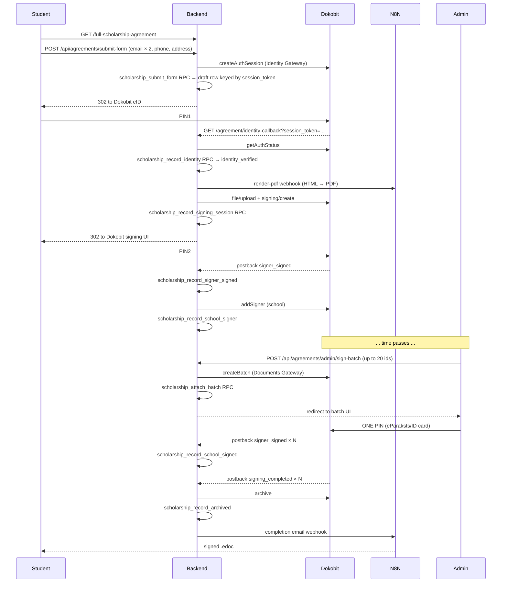
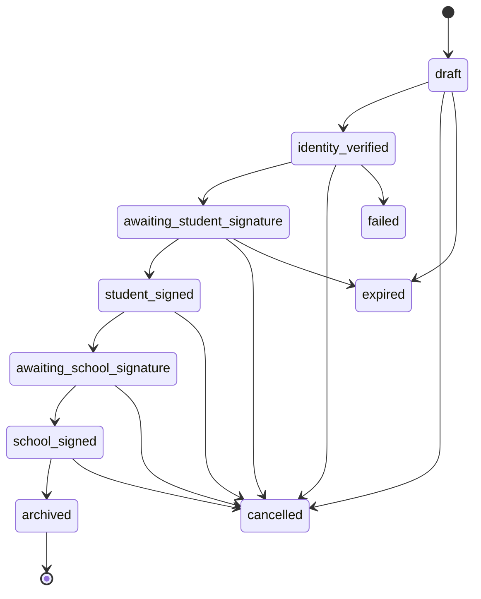

# Scholarship Agreements

> Verified against code: 2026-05-20

## Elevator pitch

Two hidden public URLs — `/full-scholarship-agreement` and
`/partial-scholarship-agreement` — let StartSchool admins onboard
pre-vetted students. The student fills a short form (email × 2, phone,
address), identifies via Dokobit eID (Smart-ID / eParaksts Mobile / ID
card), and signs the auto-filled contract. The admin batch-countersigns
from `/dashboard/admin/agreements`; the fully signed `.edoc` is then
emailed to the student via n8n.

## Flow



## State machine



## RPCs

| RPC | Grant | Purpose |
|---|---|---|
| `scholarship_submit_form(...)` | service_role | Create draft from form + Dokobit session token |
| `scholarship_record_identity(...)` | service_role | Lock eID-verified identity on the draft |
| `scholarship_record_signing_session(...)` | service_role | After PDF render + Dokobit signing/create |
| `scholarship_record_signer_signed(text)` | service_role | Student PIN2 webhook |
| `scholarship_record_school_signer(uuid,text)` | service_role | After addSigner (Smart-ID path) |
| `scholarship_attach_batch(uuid[],text)` | service_role | Bulk admin batch (eParaksts/ID card) |
| `scholarship_record_school_signed(text)` | service_role | School PIN2 webhook |
| `scholarship_record_archived(uuid,text)` | service_role | After signed `.edoc` archive |
| `scholarship_record_event(uuid,enum,jsonb)` | service_role | Generic append-only audit entry |
| `scholarship_cancel(uuid,text)` | service_role | Admin cancellation |
| `scholarship_reset_for_retry(uuid)` | service_role | Recovery from stuck identity_verified/failed |
| `scholarship_expire_pending()` | service_role | Daily cron: drafts > 1 day + past `expires_at` |

Every RPC has `SET search_path = public, pg_catalog`, is `SECURITY
DEFINER`, and is `REVOKE`d from `public`/`anon`/`authenticated`. Writes
never bypass the RPC layer — the data facade calls them via the admin
client, and direct DML against the tables is denied by force-RLS.

## Anti-cheat

The partial unique index
`scholarship_agreements_signer_type_unique` on `(signer_personal_code,
agreement_type) WHERE signer_personal_code IS NOT NULL AND status NOT IN
('cancelled','expired','failed')` blocks a single person from signing
both Full and Partial: once their personal code locks in on one row, an
attempt against the other URL fails on `scholarship_record_identity`'s
unique violation.

The Dokobit session token threading the form → callback also prevents a
second person from "completing" someone else's draft — the identity lock
is keyed to the row, and a mismatching personal code throws
`scholarship_identity_mismatch`.

## Idempotency

The Dokobit webhook handler re-verifies `getSigningStatus` before
mutating, then dispatches by state:

- `signer_signed` while `awaiting_student_signature` → student PIN2,
  then `addSigner` the school.
- `signer_signed` while `student_signed` and missing school signer token
  → mid-flow recovery, just re-runs `addSigner`.
- `signer_signed` while `awaiting_school_signature` → school PIN2.
- `signing_completed` while `school_signed` → archive + storage upload
  + completion email.
- Any other state → ack `200` (idempotent no-op). Unknown events ack so
  Dokobit stops retrying.

## How to test on sandbox

1. Sign in as admin on the develop preview.
2. Open `/full-scholarship-agreement` in a second browser/profile.
3. Fill the form with `test_*@example.com`.
4. Identify with Smart-ID DEMO; complete PIN1.
5. Verify the rendered PDF matches the submitted data.
6. Sign with PIN2.
7. Confirm the redirect to `/agreement/thank-you/{id}`.
8. Back in the admin panel, select the row, click "Sign selected",
   choose the batch path (eParaksts test card).
9. Verify the completion email lands with the `.edoc` attached.

## How to roll back

1. Stop new traffic by deploying a feature-flag check at the
   `/api/agreements/submit-form` route + admin page entry.
2. To revert schema, drop in this order:

   ```sql
   drop table scholarship_agreement_events;
   drop table scholarship_agreements;
   drop type scholarship_event_type;
   drop type scholarship_agreement_status;
   drop type scholarship_agreement_language;
   drop type scholarship_agreement_type;
   ```

3. Restore from the manual Supabase backup taken before the migrations.

## Troubleshooting

| Symptom | Likely cause | Fix |
|---|---|---|
| `403 ip_not_allowed` on webhook | `DOKOBIT_POSTBACK_ALLOWLIST` is set and the Dokobit IP isn't in it | Add the IP from the error log; redeploy |
| Stuck at `identity_verified` | n8n render-pdf failed | Open the row in admin, click "Retry PDF + signing" |
| Stuck at `failed` | Dokobit signing create or archive failed | Same "Retry PDF + signing" rebuilds from the stored auth token |
| Mismatch error on retry | A different person attempted the URL | Expected — issue a new agreement |
| Diacritics show as boxes | n8n PDF renderer can't load Google Fonts | Self-host Noto in n8n and reference via local file URLs |
| Realtime not updating admin modal | Tables not in `supabase_realtime` publication | Re-run the publication ADD from `scholarship_rls` migration |
| Batch fails for admin | Admin only has Smart-ID | Use the sequential path (one PIN per doc) |

## GDPR

### Legal basis

- **GDPR Art. 6(1)(b)** — contract performance. The student is becoming
  a party to a scholarship agreement; processing their data is necessary
  to conclude and execute that contract.
- **GDPR Art. 6(1)(c)** — legal obligation. Latvian accounting law
  requires contracts to be retained for at least 10 years.

### Data we collect and where it comes from

| Field | Source | Purpose |
|---|---|---|
| Name, surname | Dokobit eID | Contract text + identity lock |
| Personal code | Dokobit eID | Contract text + identity lock |
| Country code | Dokobit eID | Contract text |
| Email | Student form | Contract text + correspondence |
| Phone | Student form | Contract text |
| Address | Student form | Contract text |
| Signed `.edoc` | Dokobit archive | Legal record |

### Retention

No automatic deletion. Signed contracts are exported manually to
StartSchool's Google Drive after each cohort intake completes and remain
in Supabase Storage indefinitely for legal hold. Abandoned drafts (form
submitted but no identity lock within 24 hours) are reaped by the daily
cron via `scholarship_expire_pending`.

### Where data lives

- **Supabase Postgres + Storage** — region `eu-central-1`
- **Dokobit Identity & Documents Gateway** — Lithuania (EU)
- **n8n** — verify the hosting region in pre-flight before production
- **StartSchool Google Drive** — controlled by StartSchool admins; access
  audit-logged by Google Workspace

### Data subject rights

- **Access:** student emails StartSchool; admin downloads the `.edoc` and
  forwards it.
- **Rectification:** admin cancels and re-issues with corrected data —
  the existing signature cannot be modified.
- **Erasure:** subject to legal hold (10-year accounting retention).
  Manual via admin once retention has elapsed.
- **Complaint:** Datu valsts inspekcija (Data State Inspectorate, LV).
