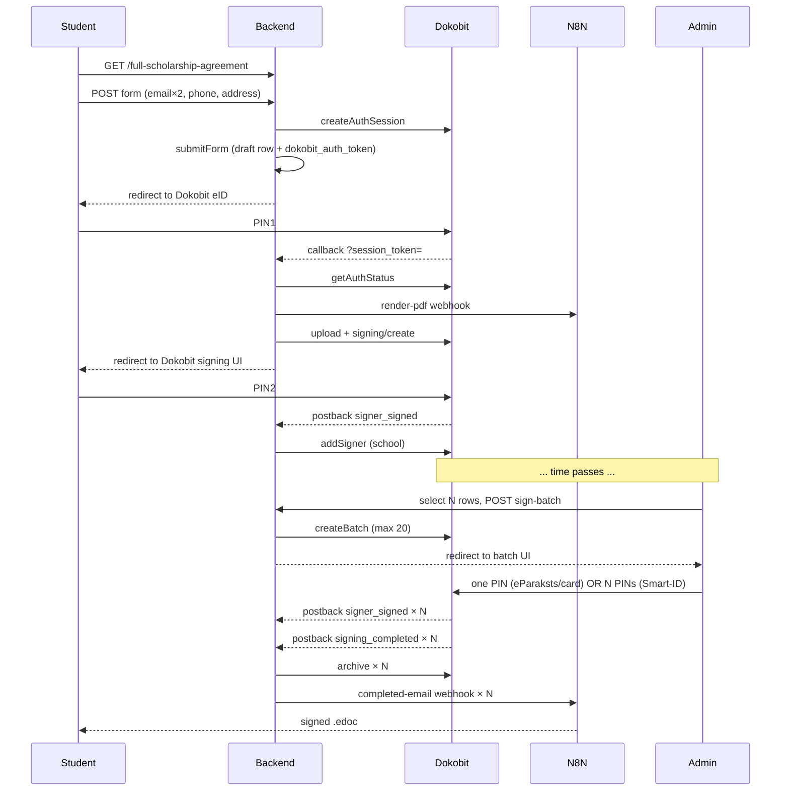
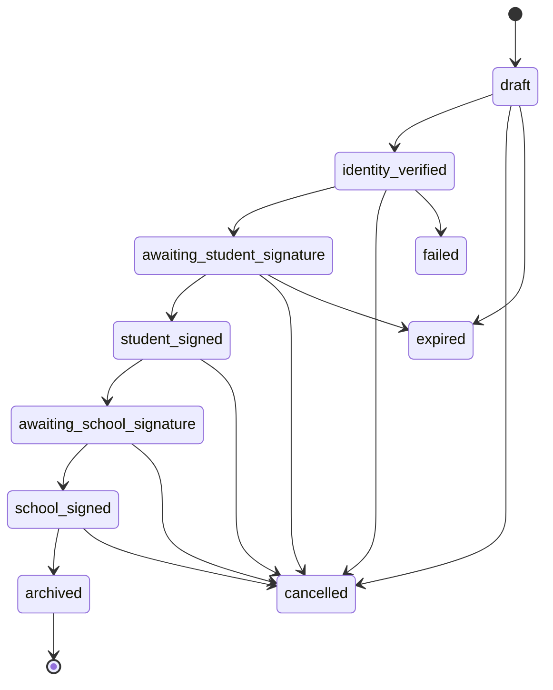

# Scholarship Agreement Signing Implementation Plan (v2 — student-driven)

> **For agentic workers:** REQUIRED SUB-SKILL: Use superpowers:subagent-driven-development (recommended) or superpowers:executing-plans to implement this plan task-by-task. Steps use checkbox (`- [ ]`) syntax for tracking.

**Goal:** Dokobit-backed scholarship agreement module — two public shared links (`/full-scholarship-agreement`, `/partial-scholarship-agreement`). Student fills a short form (email twice + phone + address), identifies with eID (Smart-ID, eParaksts Mobile, ID card), signs the pre-filled contract. Admin batch-countersigns from the admin panel. Final `.edoc` emailed via n8n to the student.

**Architecture:** Self-contained module under `src/lib/scholarship/` + `src/lib/dokobit/`. All writes go through SECURITY DEFINER RPCs. Database state is the source of truth. n8n owns HTML→PDF render + completion email. Built V2-compatible from day 1. CI seam audit prevents cross-module imports.

**Tech Stack:** Next.js 16 App Router, React 19, TypeScript 5, Supabase (Postgres + Storage + pg_cron), Dokobit Identity Gateway + Documents Gateway APIs (including `createbatch.json`), n8n webhooks, Vitest, Handlebars templates.

**Project ID:** `ksoohvygoysofvtqdumz`

**Branch:** `feature/scholarship-agreements` off `develop`

---

## Key design decisions (v2 changes from v1)

| Decision | Why |
|---|---|
| No admin pre-create; no per-student token | Admin doesn't know student's phone/address; URLs are public + admin emails them manually |
| Form fields: `email`, `confirm_email`, `phone`, `address` | Email twice to catch typos. Address typos acceptable. eID supplies name/surname/personal code |
| Two HBS templates, terms hardcoded | Program fees are fixed; no per-row `payment_terms` JSON |
| Draft row identified by `dokobit_auth_token` (session_token) | No URL token; the Dokobit session token threads form → identity callback |
| Bulk school countersign via `createbatch.json` (max 20) OR sequential queue | `createbatch.json` works only with eParaksts Mobile / SmartCard / USB token. Smart-ID = per-doc PIN. Build both paths |
| No invite webhook | Admin sends emails manually (Gmail/Wix) |
| `unique (signer_personal_code, agreement_type) WHERE NOT NULL` | One contract per real person per program type — prevents partial→full cheat |

## Status enum (slimmer than v1)

`draft` → `identity_verified` → `awaiting_student_signature` → `student_signed` → `awaiting_school_signature` → `school_signed` → `archived`

Terminal: `cancelled`, `expired`, `failed`.

---

## File Structure

### New files

| Path | Purpose |
|---|---|
| `src/lib/dokobit/client.ts` | Base fetch wrapper, error mapping |
| `src/lib/dokobit/identity.ts` | Identity Gateway calls |
| `src/lib/dokobit/signing.ts` | Documents Gateway calls + batch |
| `src/lib/dokobit/types.ts` | Zod response schemas |
| `src/lib/dokobit/README.md` | Module README |
| `src/lib/scholarship/state-machine.ts` | Allowed-transition map |
| `src/lib/scholarship/auth.ts` | `requireAdmin()` server helper |
| `src/lib/scholarship/n8n.ts` | Two webhook callers (render-pdf, completed) |
| `src/lib/scholarship/pdf.ts` | Render HBS → HTML → n8n PDF |
| `src/lib/scholarship/complete-identity.ts` | Helper: eID → PDF → Dokobit signing |
| `src/lib/scholarship/data.ts` | DB ops facade |
| `src/lib/scholarship/templates/full-scholarship-en.hbs` | Full contract template (from docx) |
| `src/lib/scholarship/templates/partial-scholarship-en.hbs` | Partial contract template (placeholder — boss provides copy) |
| `src/lib/scholarship/README.md` | Module README |
| `src/components/scholarship/StatusBadge.tsx` | Status pill |
| `src/components/scholarship/AgreementForm.tsx` | Student form (email × 2, phone, address) |
| `src/components/scholarship/PublicAgreementCard.tsx` | Public landing card wrapper |
| `src/components/scholarship/ThankYouCard.tsx` | Thank-you card |
| `src/components/scholarship/AgreementsTable.tsx` | Admin list with bulk select |
| `src/components/scholarship/AgreementDetailModal.tsx` | Admin detail modal |
| `src/components/scholarship/BulkSignDialog.tsx` | Admin batch/sequential signing UI |
| `src/app/full-scholarship-agreement/page.tsx` | Public page (full) |
| `src/app/full-scholarship-agreement/layout.tsx` | noindex meta |
| `src/app/partial-scholarship-agreement/page.tsx` | Public page (partial) |
| `src/app/partial-scholarship-agreement/layout.tsx` | noindex meta |
| `src/app/agreement/identity-callback/page.tsx` | Dokobit return target |
| `src/app/agreement/identity-callback/loading.tsx` | Streaming loading UI |
| `src/app/agreement/thank-you/[id]/page.tsx` | Post-sign page |
| `src/app/api/agreements/submit-form/route.ts` | Public form submit + Dokobit auth session create |
| `src/app/api/agreements/admin/route.ts` | Admin list |
| `src/app/api/agreements/admin/[id]/route.ts` | Admin detail/cancel |
| `src/app/api/agreements/admin/[id]/sign-single/route.ts` | Single-doc school signing URL (Smart-ID path) |
| `src/app/api/agreements/admin/sign-batch/route.ts` | Bulk batch signing URL (eParaksts/card path) |
| `src/app/api/agreements/admin/[id]/retry/route.ts` | Recover from stuck-at-identity_verified |
| `src/app/api/agreements/admin/[id]/download/route.ts` | Admin signed URL |
| `src/app/api/webhooks/dokobit/route.ts` | Postback handler |
| `src/app/dashboard/admin/agreements/page.tsx` | Admin page |
| `public/robots.txt` | Crawler disallow |
| `scripts/seam-audit.mjs` | CI cross-module-import check |
| `tests/scholarship/state-machine.test.ts` | Unit tests |
| `tests/scholarship/form-schema.test.ts` | Zod tests |
| `tests/scholarship/templates.test.ts` | Snapshot tests |
| `tests/scholarship/webhook.test.ts` | Postback handler |
| `tests/scholarship/rls.test.ts` | RLS verification |
| `tests/scholarship/data.test.ts` | DB facade integration |
| `docs/documentation/scholarship-agreements.md` | Domain doc |
| `docs/pages/public/full-scholarship-agreement.md` | Page doc |
| `docs/pages/public/partial-scholarship-agreement.md` | Page doc |
| `docs/pages/public/agreement-thank-you.md` | Page doc |
| `docs/pages/public/agreement-identity-callback.md` | Page doc |
| `docs/pages/admin/agreements.md` | Page doc |
| `docs/V2_schema/scholarship_agreements.md` | V2 schema doc |
| `docs/V2_schema/scholarship_agreement_events.md` | V2 schema doc |

### Modified files

| Path | Change |
|---|---|
| `package.json` | Add `handlebars` dependency |
| `src/lib/validation-schemas.ts` | Add scholarship form Zod schema |
| `src/lib/supabase/middleware.ts` | Add `X-Robots-Tag` for scholarship paths; classify public routes |
| `src/types/database.ts` | Regenerated after migrations |
| `package.json` scripts | Add `seam-audit`; wire into `lint` |
| `docs/pages/README.md` | Link new page docs |
| `docs/V2_schema/README.md` | Link new schema docs |
| `.env.example` | Add env vars |

---

## Task 0: Pre-flight checks

- [ ] **Step 1: Verify branch**

```bash
git status
```

Expected: `On branch develop` or `feature/scholarship-agreements`.

- [ ] **Step 2: Create the feature branch if needed**

```bash
git checkout -b feature/scholarship-agreements
```

- [ ] **Step 3: Take a manual Supabase backup**

Open Supabase dashboard for `ksoohvygoysofvtqdumz` → Database → Backups → "Take backup now". Note the timestamp.

- [ ] **Step 4: Confirm baseline tests**

```bash
npm test
```

Expected: all existing tests pass.

- [ ] **Step 5: Verify `users.data` SDK access pattern**

```bash
grep -rn "primary_role" src/
```

Note which pattern existing admin code uses (`.from("users.data" as any)`, `.from("users" as never)`, view alias, or RPC). The `requireAdmin()` helper MUST match.

Write the actual pattern here: ___________________________________________

- [ ] **Step 6: Verify `useApp()` exposes `primary_role`**

```bash
grep -n "primary_role" src/contexts/app-context.tsx
```

Field name: ___________________________________________

If missing, extend the context first.

- [ ] **Step 7: Verify `pg_cron` is enabled**

Via `mcp__supabase__execute_sql`:

```sql
select extname, extversion from pg_extension where extname = 'pg_cron';
```

Expected: one row. If missing, enable via Supabase Studio.

---

## Task 1: Install dependencies

- [ ] **Step 1: Install handlebars**

```bash
npm install handlebars
```

- [ ] **Step 2: Verify**

```bash
npm list handlebars
```

- [ ] **Step 3: Commit**

```bash
git add package.json package-lock.json
git commit -m "feat(scholarship): add handlebars dependency"
```

---

## Task 2: Schema migration — enums + tables

- [ ] **Step 1: Apply migration via Supabase MCP**

Use `mcp__supabase__apply_migration` with name `scholarship_enums_and_tables`:

```sql
-- Enums
create type scholarship_agreement_type as enum ('full', 'partial');
create type scholarship_agreement_language as enum ('lv', 'en');
create type scholarship_agreement_status as enum (
  'draft','identity_verified',
  'awaiting_student_signature','student_signed',
  'awaiting_school_signature','school_signed',
  'archived','cancelled','expired','failed'
);
create type scholarship_event_type as enum (
  'form_submitted','identity_started','identity_verified','identity_mismatch',
  'signing_created','signer_signed','school_signer_added','signing_completed',
  'archived','email_completed_sent','cancelled','expired','error'
);

-- Main table
create table scholarship_agreements (
  id                          uuid primary key default gen_random_uuid(),
  agreement_type              scholarship_agreement_type not null,

  -- Form-collected
  recipient_email             text not null,
  recipient_phone             text not null,
  recipient_address           text not null,

  -- eID-collected
  signer_personal_code        text,
  signer_country_code         text,
  signer_name                 text,
  signer_surname              text,
  identity_verified_at        timestamptz,

  language                    scholarship_agreement_language not null default 'en',

  -- Dokobit tokens
  dokobit_auth_token          text,
  dokobit_signing_token       text,
  dokobit_signer_token        text,
  dokobit_school_signer_token text,
  dokobit_batch_token         text,

  -- Storage paths
  unsigned_pdf_path           text,
  signed_doc_path             text,

  status                      scholarship_agreement_status not null default 'draft',
  status_reason               text,

  student_signed_at           timestamptz,
  school_signed_at            timestamptz,
  archived_at                 timestamptz,
  expires_at                  timestamptz not null,

  created_at                  timestamptz not null default now(),
  updated_at                  timestamptz not null default now(),

  constraint scholarship_agreements_email_len
    check (length(recipient_email) between 3 and 320),
  constraint scholarship_agreements_phone_len
    check (length(recipient_phone) between 4 and 32),
  constraint scholarship_agreements_address_len
    check (length(recipient_address) between 4 and 500)
);

create index scholarship_agreements_status_expires_idx
  on scholarship_agreements (status, expires_at);
create index scholarship_agreements_email_idx
  on scholarship_agreements (recipient_email);
create index scholarship_agreements_auth_token_idx
  on scholarship_agreements (dokobit_auth_token)
  where dokobit_auth_token is not null;
create index scholarship_agreements_signing_token_idx
  on scholarship_agreements (dokobit_signing_token)
  where dokobit_signing_token is not null;
create index scholarship_agreements_batch_token_idx
  on scholarship_agreements (dokobit_batch_token)
  where dokobit_batch_token is not null;

-- Prevent partial→full cheat: one signed contract per real person per type
create unique index scholarship_agreements_signer_type_unique
  on scholarship_agreements (signer_personal_code, agreement_type)
  where signer_personal_code is not null
    and status not in ('cancelled','expired','failed');

create or replace function scholarship_agreements_set_updated_at()
returns trigger language plpgsql as $$
begin new.updated_at := now(); return new; end;
$$;

create trigger trg_scholarship_agreements_updated_at
  before update on scholarship_agreements
  for each row execute function scholarship_agreements_set_updated_at();

-- Event log (append-only)
create table scholarship_agreement_events (
  id              uuid primary key default gen_random_uuid(),
  agreement_id    uuid not null references scholarship_agreements(id) on delete cascade,
  event_type      scholarship_event_type not null,
  payload         jsonb,
  occurred_at     timestamptz not null default now()
);

create index scholarship_agreement_events_agreement_idx
  on scholarship_agreement_events (agreement_id, occurred_at desc);
create index scholarship_agreement_events_type_idx
  on scholarship_agreement_events (event_type, occurred_at desc);

create or replace function scholarship_events_block_mutation()
returns trigger language plpgsql as $$
begin raise exception 'scholarship_agreement_events is append-only'; end;
$$;

create trigger trg_scholarship_events_no_update
  before update on scholarship_agreement_events
  for each row execute function scholarship_events_block_mutation();
create trigger trg_scholarship_events_no_delete
  before delete on scholarship_agreement_events
  for each row execute function scholarship_events_block_mutation();
```

- [ ] **Step 2: Verify via MCP `list_tables`**

Both tables present with expected columns and the unique partial index.

- [ ] **Step 3: Regenerate database types**

```bash
npx supabase gen types typescript --project-id ksoohvygoysofvtqdumz > src/types/database.ts
```

- [ ] **Step 4: Commit**

```bash
git add src/types/database.ts
git commit -m "feat(scholarship): agreements + events tables and enums"
```

---

## Task 3: RLS deny-all + admin SELECT + Realtime publication

- [ ] **Step 1: Apply RLS migration** (`scholarship_rls`)

```sql
alter table scholarship_agreements enable row level security;
alter table scholarship_agreements force row level security;
alter table scholarship_agreement_events enable row level security;
alter table scholarship_agreement_events force row level security;

-- Admin SELECT only (for Realtime channel on the admin page)
-- NOTE: existing codebase uses `users` table (not `"users.data"`) — verified
-- in src/contexts/app-context.tsx and src/app/api/admin/users/route.ts.
create policy "admin_select_agreements"
  on scholarship_agreements for select to authenticated
  using (exists (select 1 from users u where u.id = auth.uid() and u.primary_role = 'admin'));

create policy "admin_select_events"
  on scholarship_agreement_events for select to authenticated
  using (exists (select 1 from users u where u.id = auth.uid() and u.primary_role = 'admin'));

-- No INSERT/UPDATE/DELETE policies. All writes via SECURITY DEFINER RPCs.
```

- [ ] **Step 2: Add tables to Realtime publication**

```sql
alter publication supabase_realtime add table scholarship_agreements;
alter publication supabase_realtime add table scholarship_agreement_events;
```

(Errors if already a member — fine.)

- [ ] **Step 3: Verify**

```sql
select tablename, rowsecurity, forcerowsecurity from pg_tables
join pg_class on pg_class.relname = pg_tables.tablename
where tablename in ('scholarship_agreements','scholarship_agreement_events');

select tablename, policyname, cmd from pg_policies
where tablename in ('scholarship_agreements','scholarship_agreement_events');
```

- [ ] **Step 4: Commit**

```bash
git commit --allow-empty -m "feat(scholarship): RLS deny-all + admin SELECT + realtime"
```

---

## Task 4: SECURITY DEFINER RPCs — Part 1 (form + identity)

- [ ] **Step 1: Apply migration** (`scholarship_rpcs_part1`)

```sql
-- ============================================================
-- scholarship_submit_form
-- Creates the draft row from student form data + the Dokobit session
-- token returned from createAuthSession (called server-side first).
-- ============================================================
create or replace function scholarship_submit_form(
  p_type           scholarship_agreement_type,
  p_email          text,
  p_phone          text,
  p_address        text,
  p_language       scholarship_agreement_language,
  p_dokobit_auth_token text,
  p_expires_at     timestamptz
)
returns scholarship_agreements
language plpgsql security definer
set search_path = public, pg_catalog as $$
declare v_row scholarship_agreements;
begin
  insert into scholarship_agreements (
    agreement_type, recipient_email, recipient_phone, recipient_address,
    language, dokobit_auth_token, expires_at, status
  ) values (
    p_type, p_email, p_phone, p_address,
    p_language, p_dokobit_auth_token, p_expires_at, 'draft'
  )
  returning * into v_row;

  insert into scholarship_agreement_events (agreement_id, event_type, payload)
  values (v_row.id, 'form_submitted',
          jsonb_build_object('email', p_email));
  insert into scholarship_agreement_events (agreement_id, event_type)
  values (v_row.id, 'identity_started');

  return v_row;
end;
$$;
revoke execute on function scholarship_submit_form(
  scholarship_agreement_type, text, text, text,
  scholarship_agreement_language, text, timestamptz
) from public, anon, authenticated;
grant execute on function scholarship_submit_form(
  scholarship_agreement_type, text, text, text,
  scholarship_agreement_language, text, timestamptz
) to service_role;

-- ============================================================
-- scholarship_record_identity
-- Locks identity after Dokobit eID. Rejects mismatches on retry.
-- ============================================================
create or replace function scholarship_record_identity(
  p_dokobit_auth_token text,
  p_personal_code      text,
  p_country_code       text,
  p_name               text,
  p_surname            text
)
returns scholarship_agreements
language plpgsql security definer
set search_path = public, pg_catalog as $$
declare v_row scholarship_agreements;
begin
  select * into v_row from scholarship_agreements
  where dokobit_auth_token = p_dokobit_auth_token;
  if not found then raise exception 'scholarship_not_found'; end if;

  -- Identity already locked? Reject mismatches.
  if v_row.signer_personal_code is not null
     and v_row.signer_personal_code <> p_personal_code then
    insert into scholarship_agreement_events (agreement_id, event_type, payload)
    values (v_row.id, 'identity_mismatch',
            jsonb_build_object('attempted', p_personal_code,
                               'locked', v_row.signer_personal_code));
    raise exception 'scholarship_identity_mismatch';
  end if;

  update scholarship_agreements
  set signer_personal_code = p_personal_code,
      signer_country_code  = p_country_code,
      signer_name          = p_name,
      signer_surname       = p_surname,
      identity_verified_at = coalesce(identity_verified_at, now()),
      status               = case when status = 'draft' then 'identity_verified' else status end
  where id = v_row.id
  returning * into v_row;

  insert into scholarship_agreement_events (agreement_id, event_type, payload)
  values (v_row.id, 'identity_verified',
          jsonb_build_object('personal_code', p_personal_code,
                             'country_code', p_country_code));

  return v_row;
end;
$$;
revoke execute on function scholarship_record_identity(text, text, text, text, text)
  from public, anon, authenticated;
grant execute on function scholarship_record_identity(text, text, text, text, text)
  to service_role;
```

- [ ] **Step 2: Verify**

```sql
select proname, prosecdef from pg_proc where proname like 'scholarship_%' order by proname;
```

All show `prosecdef = true`.

- [ ] **Step 3: Commit**

```bash
git commit --allow-empty -m "feat(scholarship): RPCs for form submit + identity"
```

---

## Task 5: SECURITY DEFINER RPCs — Part 2 (signing + bulk + archive + cancel + expire)

- [ ] **Step 1: Apply migration** (`scholarship_rpcs_part2`)

```sql
-- ============================================================
-- scholarship_record_signing_session
-- After PDF render + Dokobit signing create
-- ============================================================
create or replace function scholarship_record_signing_session(
  p_id uuid,
  p_signing_token text,
  p_signer_token text,
  p_unsigned_pdf_path text
)
returns scholarship_agreements
language plpgsql security definer
set search_path = public, pg_catalog as $$
declare v_row scholarship_agreements;
begin
  update scholarship_agreements
  set dokobit_signing_token = p_signing_token,
      dokobit_signer_token  = p_signer_token,
      unsigned_pdf_path     = p_unsigned_pdf_path,
      status                = 'awaiting_student_signature'
  where id = p_id and status = 'identity_verified'
  returning * into v_row;

  if not found then raise exception 'scholarship_state_transition_denied'; end if;

  insert into scholarship_agreement_events (agreement_id, event_type, payload)
  values (v_row.id, 'signing_created',
          jsonb_build_object('signing_token', p_signing_token));
  return v_row;
end;
$$;
revoke execute on function scholarship_record_signing_session(uuid, text, text, text)
  from public, anon, authenticated;
grant execute on function scholarship_record_signing_session(uuid, text, text, text)
  to service_role;

-- ============================================================
-- scholarship_record_signer_signed (student PIN2)
-- ============================================================
create or replace function scholarship_record_signer_signed(p_signing_token text)
returns scholarship_agreements
language plpgsql security definer
set search_path = public, pg_catalog as $$
declare v_row scholarship_agreements;
begin
  update scholarship_agreements
  set status            = 'student_signed',
      student_signed_at = now()
  where dokobit_signing_token = p_signing_token
    and status = 'awaiting_student_signature'
  returning * into v_row;

  if not found then raise exception 'scholarship_state_transition_denied'; end if;
  insert into scholarship_agreement_events (agreement_id, event_type)
  values (v_row.id, 'signer_signed');
  return v_row;
end;
$$;
revoke execute on function scholarship_record_signer_signed(text)
  from public, anon, authenticated;
grant execute on function scholarship_record_signer_signed(text) to service_role;

-- ============================================================
-- scholarship_record_school_signer (after addsigner — single-doc path)
-- ============================================================
create or replace function scholarship_record_school_signer(
  p_id uuid,
  p_school_signer_token text
)
returns scholarship_agreements
language plpgsql security definer
set search_path = public, pg_catalog as $$
declare v_row scholarship_agreements;
begin
  update scholarship_agreements
  set dokobit_school_signer_token = p_school_signer_token,
      status                      = 'awaiting_school_signature'
  where id = p_id and status = 'student_signed'
  returning * into v_row;

  if not found then raise exception 'scholarship_state_transition_denied'; end if;
  insert into scholarship_agreement_events (agreement_id, event_type)
  values (v_row.id, 'school_signer_added');
  return v_row;
end;
$$;
revoke execute on function scholarship_record_school_signer(uuid, text)
  from public, anon, authenticated;
grant execute on function scholarship_record_school_signer(uuid, text) to service_role;

-- ============================================================
-- scholarship_attach_batch
-- Attach a batch_token to N agreements when admin starts a batch session
-- ============================================================
create or replace function scholarship_attach_batch(
  p_ids uuid[],
  p_batch_token text
)
returns int
language plpgsql security definer
set search_path = public, pg_catalog as $$
declare v_count int;
begin
  update scholarship_agreements
  set dokobit_batch_token = p_batch_token,
      status              = 'awaiting_school_signature'
  where id = any (p_ids)
    and status = 'student_signed';
  get diagnostics v_count = row_count;

  insert into scholarship_agreement_events (agreement_id, event_type, payload)
  select id, 'school_signer_added',
         jsonb_build_object('batch_token', p_batch_token)
  from scholarship_agreements
  where dokobit_batch_token = p_batch_token;

  return v_count;
end;
$$;
revoke execute on function scholarship_attach_batch(uuid[], text)
  from public, anon, authenticated;
grant execute on function scholarship_attach_batch(uuid[], text) to service_role;

-- ============================================================
-- scholarship_record_school_signed (per-signing webhook)
-- ============================================================
create or replace function scholarship_record_school_signed(p_signing_token text)
returns scholarship_agreements
language plpgsql security definer
set search_path = public, pg_catalog as $$
declare v_row scholarship_agreements;
begin
  update scholarship_agreements
  set status            = 'school_signed',
      school_signed_at  = now()
  where dokobit_signing_token = p_signing_token
    and status = 'awaiting_school_signature'
  returning * into v_row;

  if not found then raise exception 'scholarship_state_transition_denied'; end if;
  insert into scholarship_agreement_events (agreement_id, event_type)
  values (v_row.id, 'signing_completed');
  return v_row;
end;
$$;
revoke execute on function scholarship_record_school_signed(text)
  from public, anon, authenticated;
grant execute on function scholarship_record_school_signed(text) to service_role;

-- ============================================================
-- scholarship_record_archived
-- ============================================================
create or replace function scholarship_record_archived(
  p_id uuid,
  p_signed_doc_path text
)
returns scholarship_agreements
language plpgsql security definer
set search_path = public, pg_catalog as $$
declare v_row scholarship_agreements;
begin
  update scholarship_agreements
  set status          = 'archived',
      signed_doc_path = p_signed_doc_path,
      archived_at     = now()
  where id = p_id and status = 'school_signed'
  returning * into v_row;

  if not found then raise exception 'scholarship_state_transition_denied'; end if;
  insert into scholarship_agreement_events (agreement_id, event_type)
  values (v_row.id, 'archived');
  return v_row;
end;
$$;
revoke execute on function scholarship_record_archived(uuid, text)
  from public, anon, authenticated;
grant execute on function scholarship_record_archived(uuid, text) to service_role;

-- ============================================================
-- scholarship_record_event (generic)
-- ============================================================
create or replace function scholarship_record_event(
  p_id uuid,
  p_event_type scholarship_event_type,
  p_payload jsonb
)
returns void language plpgsql security definer
set search_path = public, pg_catalog as $$
begin
  insert into scholarship_agreement_events (agreement_id, event_type, payload)
  values (p_id, p_event_type, p_payload);
end;
$$;
revoke execute on function scholarship_record_event(uuid, scholarship_event_type, jsonb)
  from public, anon, authenticated;
grant execute on function scholarship_record_event(uuid, scholarship_event_type, jsonb)
  to service_role;

-- ============================================================
-- scholarship_cancel
-- ============================================================
create or replace function scholarship_cancel(p_id uuid, p_reason text)
returns scholarship_agreements
language plpgsql security definer
set search_path = public, pg_catalog as $$
declare v_row scholarship_agreements;
begin
  update scholarship_agreements
  set status = 'cancelled', status_reason = p_reason
  where id = p_id and status <> 'archived'
  returning * into v_row;

  if not found then raise exception 'scholarship_state_transition_denied'; end if;
  insert into scholarship_agreement_events (agreement_id, event_type, payload)
  values (v_row.id, 'cancelled', jsonb_build_object('reason', p_reason));
  return v_row;
end;
$$;
revoke execute on function scholarship_cancel(uuid, text)
  from public, anon, authenticated;
grant execute on function scholarship_cancel(uuid, text) to service_role;

-- ============================================================
-- scholarship_reset_for_retry
-- Admin retry from stuck identity_verified / failed
-- ============================================================
create or replace function scholarship_reset_for_retry(p_id uuid)
returns scholarship_agreements
language plpgsql security definer
set search_path = public, pg_catalog as $$
declare v_row scholarship_agreements;
begin
  update scholarship_agreements
  set status                      = 'identity_verified',
      dokobit_signing_token       = null,
      dokobit_signer_token        = null,
      dokobit_school_signer_token = null,
      dokobit_batch_token         = null,
      unsigned_pdf_path           = null,
      status_reason               = null
  where id = p_id
    and status in ('identity_verified','failed')
    and identity_verified_at is not null
  returning * into v_row;

  if not found then raise exception 'scholarship_state_transition_denied'; end if;
  insert into scholarship_agreement_events (agreement_id, event_type, payload)
  values (v_row.id, 'error', jsonb_build_object('action','reset_for_retry'));
  return v_row;
end;
$$;
revoke execute on function scholarship_reset_for_retry(uuid)
  from public, anon, authenticated;
grant execute on function scholarship_reset_for_retry(uuid) to service_role;

-- ============================================================
-- scholarship_expire_pending — daily cron
-- Expires:
--  - drafts older than 1 day (abandoned form submissions, no identity)
--  - rows past expires_at not yet terminal
-- ============================================================
create or replace function scholarship_expire_pending()
returns int language plpgsql security definer
set search_path = public, pg_catalog as $$
declare v_count int;
begin
  with expired as (
    update scholarship_agreements
    set status = 'expired'
    where (
      (status = 'draft' and created_at < now() - interval '1 day')
      or (expires_at < now() and status not in ('school_signed','archived','cancelled','expired'))
    )
    returning id
  ),
  inserted as (
    insert into scholarship_agreement_events (agreement_id, event_type)
    select id, 'expired'::scholarship_event_type from expired
    returning agreement_id
  )
  select count(*) into v_count from inserted;
  return v_count;
end;
$$;
revoke execute on function scholarship_expire_pending()
  from public, anon, authenticated;
grant execute on function scholarship_expire_pending() to service_role;

select cron.schedule(
  'scholarship_expire_pending_daily',
  '0 2 * * *',
  $$ select scholarship_expire_pending() $$
);
```

- [ ] **Step 2: Regenerate database types**

```bash
npx supabase gen types typescript --project-id ksoohvygoysofvtqdumz > src/types/database.ts
```

- [ ] **Step 3: Commit**

```bash
git add src/types/database.ts
git commit -m "feat(scholarship): RPCs signing + batch + archive + cancel + expire"
```

---

## Task 6: Zod form schema

- [ ] **Step 1: Write failing test** — create `tests/scholarship/form-schema.test.ts`:

```typescript
import { describe, it, expect } from "vitest";
import { scholarshipFormSchema } from "@/lib/validation-schemas";

describe("scholarshipFormSchema", () => {
  it("accepts a valid submission", () => {
    const r = scholarshipFormSchema.safeParse({
      agreement_type: "full",
      email: "test_a@example.com",
      confirm_email: "test_a@example.com",
      phone: "+371 20000000",
      address: "Brīvības iela 1, Rīga, LV-1010",
      language: "en",
    });
    expect(r.success).toBe(true);
  });
  it("rejects mismatched emails", () => {
    const r = scholarshipFormSchema.safeParse({
      agreement_type: "full",
      email: "a@a.com",
      confirm_email: "b@b.com",
      phone: "+371 20000000",
      address: "addr",
      language: "en",
    });
    expect(r.success).toBe(false);
    if (!r.success) {
      expect(r.error.issues.some((i) => i.path.includes("confirm_email"))).toBe(true);
    }
  });
  it("rejects bad email", () => {
    const r = scholarshipFormSchema.safeParse({
      agreement_type: "full",
      email: "not-an-email",
      confirm_email: "not-an-email",
      phone: "+371 20000000",
      address: "addr",
      language: "en",
    });
    expect(r.success).toBe(false);
  });
  it("rejects bad phone characters", () => {
    const r = scholarshipFormSchema.safeParse({
      agreement_type: "full",
      email: "a@a.com",
      confirm_email: "a@a.com",
      phone: "abc",
      address: "addr",
      language: "en",
    });
    expect(r.success).toBe(false);
  });
});
```

- [ ] **Step 2: Run, confirm fail**

```bash
npx vitest run tests/scholarship/form-schema.test.ts
```

- [ ] **Step 3: Append schema to `src/lib/validation-schemas.ts`**

```typescript
// ============================================================
// Scholarship form submission
// ============================================================
export const scholarshipFormSchema = z
  .object({
    agreement_type: z.enum(["full", "partial"]),
    email: z.string().email().max(320),
    confirm_email: z.string().email().max(320),
    phone: z.string().min(4).max(32).regex(/^[+0-9 ()\-]+$/, "Invalid phone"),
    address: z.string().min(4).max(500),
    language: z.enum(["lv", "en"]).default("en"),
  })
  .refine((v) => v.email === v.confirm_email, {
    message: "Emails do not match",
    path: ["confirm_email"],
  });

export type ScholarshipFormInput = z.infer<typeof scholarshipFormSchema>;
```

- [ ] **Step 4: Run, confirm pass**

- [ ] **Step 5: Commit**

```bash
git add src/lib/validation-schemas.ts tests/scholarship/form-schema.test.ts
git commit -m "feat(scholarship): Zod schema for student form"
```

---

## Task 7: State machine

- [ ] **Step 1: Write failing test** — create `tests/scholarship/state-machine.test.ts`:

```typescript
import { describe, it, expect } from "vitest";
import { canTransition, type ScholarshipStatus } from "@/lib/scholarship/state-machine";

const happy: Array<[ScholarshipStatus, ScholarshipStatus]> = [
  ["draft", "identity_verified"],
  ["identity_verified", "awaiting_student_signature"],
  ["awaiting_student_signature", "student_signed"],
  ["student_signed", "awaiting_school_signature"],
  ["awaiting_school_signature", "school_signed"],
  ["school_signed", "archived"],
];

describe("state-machine", () => {
  it.each(happy)("allows %s → %s", (a, b) => expect(canTransition(a, b)).toBe(true));
  it("allows cancel from non-archived", () => {
    expect(canTransition("draft", "cancelled")).toBe(true);
    expect(canTransition("archived", "cancelled")).toBe(false);
  });
  it("expire skips terminal", () => {
    expect(canTransition("identity_verified", "expired")).toBe(true);
    expect(canTransition("archived", "expired")).toBe(false);
  });
  it("rejects skipping", () => {
    expect(canTransition("draft", "student_signed")).toBe(false);
  });
});
```

- [ ] **Step 2: Implement** — create `src/lib/scholarship/state-machine.ts`:

```typescript
import type { Database } from "@/types/database";

export type ScholarshipStatus = Database["public"]["Enums"]["scholarship_agreement_status"];

const FORWARD: Record<ScholarshipStatus, ScholarshipStatus[]> = {
  draft: ["identity_verified"],
  identity_verified: ["awaiting_student_signature"],
  awaiting_student_signature: ["student_signed"],
  student_signed: ["awaiting_school_signature"],
  awaiting_school_signature: ["school_signed"],
  school_signed: ["archived"],
  archived: [],
  cancelled: [],
  expired: [],
  failed: [],
};

const TERMINAL_FOR_EXPIRE: ScholarshipStatus[] = ["school_signed", "archived", "cancelled", "expired"];

export function canTransition(from: ScholarshipStatus, to: ScholarshipStatus): boolean {
  if (to === "cancelled") return from !== "archived";
  if (to === "expired") return !TERMINAL_FOR_EXPIRE.includes(from);
  if (to === "failed") return from !== "archived" && from !== "cancelled";
  return FORWARD[from].includes(to);
}
```

- [ ] **Step 3: Pass test, commit**

```bash
git add src/lib/scholarship/state-machine.ts tests/scholarship/state-machine.test.ts
git commit -m "feat(scholarship): state-machine"
```

---

## Task 8: Dokobit client — base + identity + types

- [ ] **Step 1: Add env vars to `.env.example`**

```
# Dokobit Identity Gateway (sandbox by default)
DOKOBIT_IDENTITY_API_KEY=
DOKOBIT_IDENTITY_BASE_URL=https://id-sandbox.dokobit.com

# Dokobit Documents Gateway
DOKOBIT_DOCUMENTS_API_KEY=
DOKOBIT_DOCUMENTS_BASE_URL=https://gateway-sandbox.dokobit.com
DOKOBIT_DOCUMENTS_UI_BASE_URL=

# Postback IP allowlist (comma-separated, leave empty in sandbox)
DOKOBIT_POSTBACK_ALLOWLIST=

# n8n webhooks
N8N_SCHOLARSHIP_RENDER_PDF_URL=
N8N_SCHOLARSHIP_COMPLETED_URL=
N8N_SCHOLARSHIP_SHARED_SECRET=

# School signer
SCHOOL_SIGNER_NAME=Anna
SCHOOL_SIGNER_SURNAME=Andersone
SCHOOL_SIGNER_PERSONAL_CODE=
SCHOOL_SIGNER_COUNTRY_CODE=LV
SCHOOL_SIGNER_EMAIL=start@startschool.org
```

- [ ] **Step 2: Create `src/lib/dokobit/types.ts`**

```typescript
import { z } from "zod";

// All schemas use .passthrough() for forward-compat with Dokobit response changes.
// Hard-validate only the fields we actually read.

export const dokobitCreateAuthSessionResponse = z.object({
  status: z.literal("ok"),
  session_token: z.string(),
  url: z.string().url(),
}).passthrough();

export const dokobitAuthenticatedStatusResponse = z.object({
  status: z.literal("ok"),
  code: z.string(),
  country_code: z.string(),
  name: z.string(),
  surname: z.string(),
}).passthrough();

export const dokobitWaitingStatusResponse = z.object({
  status: z.literal("waiting"),
}).passthrough();

export const dokobitAuthStatusResponse = z.union([
  dokobitAuthenticatedStatusResponse,
  dokobitWaitingStatusResponse,
]);

export const dokobitUploadResponse = z.object({
  status: z.literal("ok"),
  token: z.string(),
}).passthrough();

const dokobitSignerEntry = z.object({
  id: z.string(),
  access_token: z.string().optional(),
  signer_access_token: z.string().optional(),
}).passthrough().transform((s) => ({
  id: s.id,
  access_token: s.access_token ?? s.signer_access_token ?? "",
})).refine((s) => s.access_token.length > 0, {
  message: "Dokobit signer has no access_token",
});

export const dokobitCreateSigningResponse = z.object({
  status: z.literal("ok"),
  token: z.string(),
  signers: z.array(dokobitSignerEntry).min(1),
}).passthrough();

export const dokobitAddSignerResponse = z.object({
  status: z.literal("ok"),
  signer_access_token: z.string().optional(),
  access_token: z.string().optional(),
}).passthrough().transform((r) => ({
  status: r.status,
  signer_access_token: r.signer_access_token ?? r.access_token ?? "",
})).refine((r) => r.signer_access_token.length > 0, {
  message: "Dokobit addsigner has no access_token",
});

export const dokobitCreateBatchResponse = z.object({
  status: z.literal("ok"),
  token: z.string(),
  url: z.string().url().optional(),
}).passthrough();

export const dokobitSigningStatusResponse = z.object({
  status: z.string(),
}).passthrough();

export const dokobitArchiveResponse = z.object({
  status: z.literal("ok"),
  file: z.object({
    name: z.string(),
    content: z.string(), // base64
  }).passthrough(),
}).passthrough();

export const dokobitWebhookPayload = z.object({
  event: z.string().optional(),
  status: z.string().optional(),
  signing_token: z.string().optional(),
  token: z.string().optional(),
}).passthrough().transform((p) => ({
  event: p.event ?? p.status ?? "",
  signing_token: p.signing_token ?? p.token ?? "",
})).refine((p) => p.signing_token.length > 0, {
  message: "webhook payload has no signing_token",
});

export type DokobitWebhookPayload = z.infer<typeof dokobitWebhookPayload>;
```

- [ ] **Step 3: Create `src/lib/dokobit/client.ts`**

```typescript
type Product = "identity" | "documents";

interface FetchOpts {
  product: Product;
  method: "GET" | "POST";
  path: string;
  body?: Record<string, unknown> | FormData;
  query?: Record<string, string>;
}

export class DokobitError extends Error {
  constructor(message: string, public readonly status: number, public readonly body: unknown) {
    super(message);
    this.name = "DokobitError";
  }
}

function configFor(product: Product) {
  if (product === "identity") {
    return {
      base: process.env.DOKOBIT_IDENTITY_BASE_URL!,
      key: process.env.DOKOBIT_IDENTITY_API_KEY!,
    };
  }
  return {
    base: process.env.DOKOBIT_DOCUMENTS_BASE_URL!,
    key: process.env.DOKOBIT_DOCUMENTS_API_KEY!,
  };
}

export async function dokobitFetch<T>(opts: FetchOpts): Promise<T> {
  const { base, key } = configFor(opts.product);
  const url = new URL(opts.path, base);
  url.searchParams.set("access_token", key);
  if (opts.query) for (const [k, v] of Object.entries(opts.query)) url.searchParams.set(k, v);

  const init: RequestInit = { method: opts.method };
  if (opts.body) {
    if (opts.body instanceof FormData) init.body = opts.body;
    else {
      init.headers = { "content-type": "application/json" };
      init.body = JSON.stringify(opts.body);
    }
  }

  const res = await fetch(url.toString(), init);
  const text = await res.text();
  let parsed: unknown;
  try { parsed = JSON.parse(text); } catch { parsed = { raw: text }; }

  if (!res.ok) {
    throw new DokobitError(
      `Dokobit ${opts.product} ${opts.method} ${opts.path}: ${res.status}`,
      res.status,
      parsed
    );
  }
  return parsed as T;
}
```

- [ ] **Step 4: Create `src/lib/dokobit/identity.ts`**

```typescript
import { dokobitFetch } from "./client";
import {
  dokobitAuthStatusResponse,
  dokobitCreateAuthSessionResponse,
} from "./types";

interface CreateAuthOpts {
  returnUrl: string;
  message?: string;
  countryCode?: string;
  authenticationMethods?: Array<
    "mobile" | "smartid" | "smartcard" | "eparaksts_mobile" | "audkenni_app"
  >;
}

export async function createAuthSession(opts: CreateAuthOpts) {
  const body: Record<string, unknown> = { return_url: opts.returnUrl };
  if (opts.message) body.message = opts.message;
  if (opts.countryCode) body.country_code = opts.countryCode;
  if (opts.authenticationMethods?.length)
    body.authentication_methods = opts.authenticationMethods;

  const raw = await dokobitFetch<unknown>({
    product: "identity",
    method: "POST",
    path: "/api/authentication/create",
    body,
  });
  return dokobitCreateAuthSessionResponse.parse(raw);
}

export async function getAuthStatus(sessionToken: string) {
  const raw = await dokobitFetch<unknown>({
    product: "identity",
    method: "GET",
    path: `/api/authentication/${sessionToken}/status`,
  });
  return dokobitAuthStatusResponse.parse(raw);
}
```

- [ ] **Step 5: Commit**

```bash
git add src/lib/dokobit/ .env.example
git commit -m "feat(dokobit): base client + identity wrapper + zod schemas"
```

---

## Task 9: Dokobit client — signing + batch

- [ ] **Step 1: Create `src/lib/dokobit/signing.ts`**

```typescript
import { dokobitFetch } from "./client";
import {
  dokobitAddSignerResponse,
  dokobitArchiveResponse,
  dokobitCreateBatchResponse,
  dokobitCreateSigningResponse,
  dokobitSigningStatusResponse,
  dokobitUploadResponse,
} from "./types";

export async function uploadFile(opts: {
  name: string;
  base64Content: string;
  digestSha256: string;
}) {
  const raw = await dokobitFetch<unknown>({
    product: "documents",
    method: "POST",
    path: "/api/file/upload.json",
    body: {
      file: { name: opts.name, digest: opts.digestSha256, content: opts.base64Content },
    },
  });
  return dokobitUploadResponse.parse(raw);
}

interface Signer {
  id: string;
  name: string;
  surname: string;
  code: string;
  country_code: string;
}

interface CreateSigningOpts {
  type: "pdf" | "asice" | "edoc";
  name: string;
  fileToken: string;
  signer: Signer;
  postbackUrl: string;
  signingPurpose?: string;
  language?: string;
  signingOptions?: Array<"mobile" | "smartid" | "stationary" | "eparaksts_mobile" | "audkenni_app">;
}

export async function createSigning(opts: CreateSigningOpts) {
  const raw = await dokobitFetch<unknown>({
    product: "documents",
    method: "POST",
    path: "/api/signing/create.json",
    body: {
      type: opts.type,
      name: opts.name,
      postback_url: opts.postbackUrl,
      language: opts.language ?? "en",
      signing_purpose: opts.signingPurpose ?? "agreement",
      signing_options: opts.signingOptions ?? ["smartid", "eparaksts_mobile", "mobile", "stationary"],
      files: [{ token: opts.fileToken }],
      signers: [opts.signer],
    },
  });
  return dokobitCreateSigningResponse.parse(raw);
}

export async function addSigner(opts: {
  signingToken: string;
  signer: Signer;
}) {
  const raw = await dokobitFetch<unknown>({
    product: "documents",
    method: "POST",
    path: `/api/signing/${opts.signingToken}/addsigner.json`,
    body: { signers: [opts.signer] },
  });
  return dokobitAddSignerResponse.parse(raw);
}

// Batch — only works with eParaksts Mobile / SmartCard / USB token.
// Max 20 signings per batch (Dokobit limit).
interface CreateBatchOpts {
  signingTokens: string[];
  signer: Signer;
  postbackUrl: string;
  language?: string;
}

export async function createBatch(opts: CreateBatchOpts) {
  if (opts.signingTokens.length === 0) throw new Error("createBatch requires at least 1 signing");
  if (opts.signingTokens.length > 20) throw new Error("createBatch max 20 signings per batch");
  const raw = await dokobitFetch<unknown>({
    product: "documents",
    method: "POST",
    path: "/api/signing/createbatch.json",
    body: {
      signers: [opts.signer],
      signings: opts.signingTokens.map((t) => ({ token: t })),
      postback_url: opts.postbackUrl,
      language: opts.language ?? "en",
      signing_options: ["eparaksts_mobile", "stationary"], // exclude smartid — not supported
    },
  });
  return dokobitCreateBatchResponse.parse(raw);
}

export async function getSigningStatus(signingToken: string) {
  const raw = await dokobitFetch<unknown>({
    product: "documents",
    method: "GET",
    path: `/api/signing/${signingToken}/status.json`,
  });
  return dokobitSigningStatusResponse.parse(raw);
}

export async function archiveSigning(signingToken: string) {
  const raw = await dokobitFetch<unknown>({
    product: "documents",
    method: "POST",
    path: `/api/signing/${signingToken}/archive.json`,
  });
  return dokobitArchiveResponse.parse(raw);
}

export function buildSigningUiUrl(signingToken: string, signerAccessToken: string) {
  const base = process.env.DOKOBIT_DOCUMENTS_UI_BASE_URL || process.env.DOKOBIT_DOCUMENTS_BASE_URL!;
  const u = new URL(`/signing/${signingToken}`, base);
  u.searchParams.set("access_token", signerAccessToken);
  return u.toString();
}

export function buildBatchUiUrl(batchToken: string) {
  const base = process.env.DOKOBIT_DOCUMENTS_UI_BASE_URL || process.env.DOKOBIT_DOCUMENTS_BASE_URL!;
  return new URL(`/signing/batch/${batchToken}`, base).toString();
}
```

- [ ] **Step 2: Commit**

```bash
git add src/lib/dokobit/signing.ts
git commit -m "feat(dokobit): signing + batch wrapper"
```

---

## Task 10: Dokobit module README

- [ ] **Step 1: Create `src/lib/dokobit/README.md`**

```markdown
# Dokobit Client

Two-product API client.

| Product | File | Env vars |
|---|---|---|
| Identity Gateway (eID auth) | `identity.ts` | `DOKOBIT_IDENTITY_*` |
| Documents Gateway (e-signing) | `signing.ts` | `DOKOBIT_DOCUMENTS_*` |

Sandbox: `id-sandbox.dokobit.com`, `gateway-sandbox.dokobit.com`.

## Batch signing

`createBatch` allows the school admin to sign up to 20 student-signed
agreements with a single PIN — but **only** with eParaksts Mobile, SmartCard,
or USB token. Smart-ID requires per-doc PIN entry (Smart-ID protocol limit,
not Dokobit). For Smart-ID admins, fall back to sequential `addSigner` +
individual signing.

## Errors

All non-2xx responses throw `DokobitError(message, status, body)`. Catch at
the API route boundary; never expose raw `body` to clients.
```

- [ ] **Step 2: Commit**

```bash
git add src/lib/dokobit/README.md
git commit -m "docs(dokobit): module README"
```

---

## Task 11: n8n webhook callers

- [ ] **Step 1: Create `src/lib/scholarship/n8n.ts`**

```typescript
import { createHmac } from "crypto";

type Payload = Record<string, unknown>;

function signBody(body: string): string {
  const secret = process.env.N8N_SCHOLARSHIP_SHARED_SECRET!;
  return createHmac("sha256", secret).update(body).digest("hex");
}

async function postToN8n(url: string, payload: Payload): Promise<Response> {
  const body = JSON.stringify(payload);
  const res = await fetch(url, {
    method: "POST",
    headers: {
      "content-type": "application/json",
      "x-startschool-signature": signBody(body),
    },
    body,
  });
  if (!res.ok) {
    throw new Error(`n8n webhook ${url}: ${res.status} ${await res.text()}`);
  }
  return res;
}

export async function renderPdf(input: {
  template_id: "full" | "partial";
  language: "lv" | "en";
  html: string;
}): Promise<Buffer> {
  const url = process.env.N8N_SCHOLARSHIP_RENDER_PDF_URL!;
  const res = await postToN8n(url, input);
  const buf = Buffer.from(await res.arrayBuffer());
  if (buf.length === 0) throw new Error("n8n render-pdf returned empty body");
  return buf;
}

export async function sendCompletedEmail(input: {
  recipient_email: string;
  recipient_name?: string;
  language: "lv" | "en";
  signed_doc_base64: string;
  signed_doc_filename: string;
}) {
  const url = process.env.N8N_SCHOLARSHIP_COMPLETED_URL!;
  await postToN8n(url, input);
}
```

- [ ] **Step 2: Commit**

```bash
git add src/lib/scholarship/n8n.ts
git commit -m "feat(scholarship): n8n webhook callers (render-pdf + completed)"
```

---

## Task 12: HBS templates + PDF renderer

The Full Scholarship template content is in `docs/superpowers/specs/full-scholarship-template.txt` — that's the source legal text from the docx.

- [ ] **Step 1: Create `src/lib/scholarship/templates/full-scholarship-en.hbs`**

Convert the docx text into a Handlebars HTML template. Top-level structure:

```handlebars
<!DOCTYPE html>
<html lang="en">
<head>
  <meta charset="utf-8" />
  <title>StartSchool Student Agreement — {{agreement_reference}}</title>
  <link rel="preconnect" href="https://fonts.googleapis.com" />
  <link
    href="https://fonts.googleapis.com/css2?family=Noto+Sans:wght@400;700&family=Noto+Serif:wght@400;700&display=swap"
    rel="stylesheet"
  />
  <style>
    body {
      font-family: "Noto Serif", "DejaVu Serif", Georgia, serif;
      font-size: 11pt; line-height: 1.5; margin: 2cm;
    }
    h1, h2 { font-family: "Noto Sans", "DejaVu Sans", sans-serif; }
    h1 { font-size: 18pt; margin-bottom: 0.5cm; }
    h2 { font-size: 13pt; margin-top: 0.8cm; }
    .meta { color: #555; font-size: 10pt; }
    ol { padding-left: 1.5em; }
    .sig-block { margin-top: 2cm; }
    .sig-line { display: inline-block; min-width: 280px; border-bottom: 1px solid #000; }
  </style>
</head>
<body>
  <h1>StartSchool Student Agreement</h1>
  <p class="meta">Reference: {{agreement_reference}} · Date: {{date_today}}</p>

  <p>
    This agreement is concluded between
    <strong>{{signer.name}} {{signer.surname}}</strong>, hereinafter Student,
    address at <strong>{{recipient_address}}</strong>, personal identity number
    <strong>{{signer.personal_code}}</strong>, and
    <strong>Tech Education Foundation</strong>, hereinafter StartSchool, address
    at Stabu iela 50-9, LV-1011 Rīga, Latvia, registration No. 50008325331,
    represented by its member of the board Anna Andersone.
  </p>

  {{!-- Insert all remaining clauses verbatim from
        docs/superpowers/specs/full-scholarship-template.txt --}}
  {{!-- Replace literal "XXX" / "+371 9 8765432" placeholders in
        "Particulars of the parties" with {{recipient_email}} and
        {{recipient_phone}} --}}

  <!-- ...full body of contract clauses 1–10 with the embedded scholarship
       branch noting "Full Tuition Scholarship: 100% coverage" applies... -->

  <h2>Particulars of the parties</h2>
  <p>
    The Student: email {{recipient_email}}, phone {{recipient_phone}}<br />
    The StartSchool: email start@startschool.org, phone +371 28660693,
    bank: Swedbank AS, SWIFT: HABALV22, IBAN: LV90HABA0551055781933,
    Tech Education Foundation.
  </p>

  <h2>Signatures of the Parties</h2>
  <p class="sig-block">
    The Student: <span class="sig-line"></span><br /><br />
    The StartSchool: <span class="sig-line"></span><br />
    Anna Andersone on behalf of Tech Education Foundation
  </p>

  <p class="meta"><em>This contract is signed electronically via Dokobit.</em></p>
</body>
</html>
```

**Implementation note:** Copy the full clause text from
`docs/superpowers/specs/full-scholarship-template.txt`. Preserve the legal
wording verbatim. The only edits:

1. Replace `(Name, Lastname)________________________` → `<strong>{{signer.name}} {{signer.surname}}</strong>`
2. Replace `address at ______________` → `address at <strong>{{recipient_address}}</strong>`
3. Replace `personal identity number ____________` → `personal identity number <strong>{{signer.personal_code}}</strong>`
4. Replace `email XXX, phone +371 9 8765432` → `email {{recipient_email}}, phone {{recipient_phone}}`
5. The "Full Tuition Scholarship: Covers 100%" clause stays since this is the **full** template. For **partial**, the partial clause stays.

- [ ] **Step 2: Create `src/lib/scholarship/templates/partial-scholarship-en.hbs`**

Same structure as the full template. Two changes:
- Title: "StartSchool Student Agreement — Partial Scholarship"
- Replace the "Full Tuition Scholarship: 100%" clause with the partial branch from the docx: *"Partial Tuition Scholarship: Covers 60% of the tuition fee. The Student shall pay €2000 partial Tuition Fee and the Enrolment fee in full."* — and keep the €1000 instalment schedule clauses (Clause 3.4) since they apply only to partial.

If boss has a separate Partial docx, swap in its content before production launch.

- [ ] **Step 3: Write failing test** — create `tests/scholarship/templates.test.ts`:

```typescript
import { describe, it, expect } from "vitest";
import { renderContractHtml } from "@/lib/scholarship/pdf";

const sampleSigner = {
  name: "Jānis",
  surname: "Bērziņš",
  personal_code: "320198-12345",
  country_code: "LV",
};

describe("renderContractHtml", () => {
  it("renders full template with form + eID data", () => {
    const html = renderContractHtml({
      agreement_type: "full",
      signer: sampleSigner,
      recipient_email: "janis@example.com",
      recipient_phone: "+371 20000000",
      recipient_address: "Brīvības iela 1, Rīga, LV-1010",
      date_today: "20.05.2026",
      agreement_reference: "SS-2026-0001",
    });
    expect(html).toContain("StartSchool Student Agreement");
    expect(html).toContain("Jānis");
    expect(html).toContain("Bērziņš");
    expect(html).toContain("320198-12345");
    expect(html).toContain("janis@example.com");
    expect(html).toContain("+371 20000000");
    expect(html).toContain("Brīvības iela 1");
    expect(html).toContain("Full Tuition Scholarship");
  });

  it("renders partial template", () => {
    const html = renderContractHtml({
      agreement_type: "partial",
      signer: sampleSigner,
      recipient_email: "a@a.com",
      recipient_phone: "+371 20000000",
      recipient_address: "addr",
      date_today: "20.05.2026",
      agreement_reference: "SS-2026-0002",
    });
    expect(html).toContain("Partial Tuition Scholarship");
    expect(html).toContain("€2000");
  });
});
```

- [ ] **Step 4: Implement `src/lib/scholarship/pdf.ts`**

```typescript
import Handlebars from "handlebars";
import { readFileSync } from "fs";
import { join } from "path";
import { renderPdf as n8nRenderPdf } from "./n8n";

export interface ContractData {
  agreement_type: "full" | "partial";
  signer: {
    name: string;
    surname: string;
    personal_code: string;
    country_code: string;
  };
  recipient_email: string;
  recipient_phone: string;
  recipient_address: string;
  date_today: string;
  agreement_reference: string;
}

const CACHE = new Map<string, HandlebarsTemplateDelegate>();

function getTemplate(name: string): HandlebarsTemplateDelegate {
  const cached = CACHE.get(name);
  if (cached) return cached;
  const path = join(process.cwd(), "src/lib/scholarship/templates", name);
  const src = readFileSync(path, "utf8");
  const compiled = Handlebars.compile(src, { noEscape: false });
  CACHE.set(name, compiled);
  return compiled;
}

export function renderContractHtml(data: ContractData): string {
  const file = data.agreement_type === "full"
    ? "full-scholarship-en.hbs"
    : "partial-scholarship-en.hbs";
  return getTemplate(file)(data);
}

export async function renderContractPdf(data: ContractData): Promise<Buffer> {
  const html = renderContractHtml(data);
  return n8nRenderPdf({
    template_id: data.agreement_type,
    language: "en",
    html,
  });
}
```

- [ ] **Step 5: Run test, confirm pass**

- [ ] **Step 6: Commit**

```bash
git add src/lib/scholarship/templates/ src/lib/scholarship/pdf.ts tests/scholarship/templates.test.ts
git commit -m "feat(scholarship): HBS templates + PDF renderer"
```

---

## Task 13: Storage bucket

- [ ] **Step 1: Create private bucket**

```sql
insert into storage.buckets (id, name, public)
values ('scholarship-documents','scholarship-documents', false)
on conflict (id) do nothing;
```

- [ ] **Step 2: Verify**

```sql
select id, public from storage.buckets where id = 'scholarship-documents';
```

`public = false`.

- [ ] **Step 3: Commit**

```bash
git commit --allow-empty -m "feat(scholarship): private storage bucket"
```

---

## Task 14: Data facade

- [ ] **Step 1: Create `src/lib/scholarship/data.ts`**

```typescript
import { createAdminClient } from "@/lib/supabase/admin";
import type { Database } from "@/types/database";

type Row = Database["public"]["Tables"]["scholarship_agreements"]["Row"];
const admin = () => createAdminClient();

export async function submitForm(input: {
  agreement_type: "full" | "partial";
  email: string;
  phone: string;
  address: string;
  language: "lv" | "en";
  dokobit_auth_token: string;
  expires_at: string;
}): Promise<Row> {
  const { data, error } = await admin().rpc("scholarship_submit_form", {
    p_type: input.agreement_type,
    p_email: input.email,
    p_phone: input.phone,
    p_address: input.address,
    p_language: input.language,
    p_dokobit_auth_token: input.dokobit_auth_token,
    p_expires_at: input.expires_at,
  });
  if (error) throw error;
  return data as Row;
}

export async function findById(id: string): Promise<Row> {
  const { data, error } = await admin()
    .from("scholarship_agreements").select("*").eq("id", id).maybeSingle();
  if (error) throw error;
  if (!data) throw new Error("scholarship_not_found");
  return data;
}

export async function findByAuthToken(token: string): Promise<Row> {
  const { data, error } = await admin()
    .from("scholarship_agreements").select("*")
    .eq("dokobit_auth_token", token).maybeSingle();
  if (error) throw error;
  if (!data) throw new Error("scholarship_not_found");
  return data;
}

export async function findBySigningToken(token: string): Promise<Row> {
  const { data, error } = await admin()
    .from("scholarship_agreements").select("*")
    .eq("dokobit_signing_token", token).maybeSingle();
  if (error) throw error;
  if (!data) throw new Error("scholarship_not_found");
  return data;
}

export async function listAgreements(filters?: {
  status?: string;
  agreement_type?: string;
  search?: string;
}): Promise<Row[]> {
  let q = admin().from("scholarship_agreements").select("*").order("created_at", { ascending: false });
  if (filters?.status) q = q.eq("status", filters.status);
  if (filters?.agreement_type) q = q.eq("agreement_type", filters.agreement_type);
  if (filters?.search) q = q.ilike("recipient_email", `%${filters.search}%`);
  const { data, error } = await q;
  if (error) throw error;
  return data ?? [];
}

export async function listAwaitingSchool(): Promise<Row[]> {
  const { data, error } = await admin()
    .from("scholarship_agreements").select("*")
    .eq("status", "student_signed")
    .order("student_signed_at", { ascending: true });
  if (error) throw error;
  return data ?? [];
}

export async function listEvents(agreementId: string) {
  const { data, error } = await admin()
    .from("scholarship_agreement_events").select("*")
    .eq("agreement_id", agreementId)
    .order("occurred_at", { ascending: false });
  if (error) throw error;
  return data ?? [];
}

export async function recordIdentity(input: {
  dokobit_auth_token: string;
  personal_code: string;
  country_code: string;
  name: string;
  surname: string;
}): Promise<Row> {
  const { data, error } = await admin().rpc("scholarship_record_identity", {
    p_dokobit_auth_token: input.dokobit_auth_token,
    p_personal_code: input.personal_code,
    p_country_code: input.country_code,
    p_name: input.name,
    p_surname: input.surname,
  });
  if (error) throw error;
  return data as Row;
}

export async function recordSigningSession(input: {
  id: string;
  signing_token: string;
  signer_token: string;
  unsigned_pdf_path: string;
}): Promise<Row> {
  const { data, error } = await admin().rpc("scholarship_record_signing_session", {
    p_id: input.id,
    p_signing_token: input.signing_token,
    p_signer_token: input.signer_token,
    p_unsigned_pdf_path: input.unsigned_pdf_path,
  });
  if (error) throw error;
  return data as Row;
}

export async function recordStudentSigned(signingToken: string): Promise<Row> {
  const { data, error } = await admin().rpc("scholarship_record_signer_signed", {
    p_signing_token: signingToken,
  });
  if (error) throw error;
  return data as Row;
}

export async function recordSchoolSigner(input: { id: string; school_signer_token: string }): Promise<Row> {
  const { data, error } = await admin().rpc("scholarship_record_school_signer", {
    p_id: input.id,
    p_school_signer_token: input.school_signer_token,
  });
  if (error) throw error;
  return data as Row;
}

export async function attachBatch(ids: string[], batchToken: string): Promise<number> {
  const { data, error } = await admin().rpc("scholarship_attach_batch", {
    p_ids: ids,
    p_batch_token: batchToken,
  });
  if (error) throw error;
  return data as number;
}

export async function recordSchoolSigned(signingToken: string): Promise<Row> {
  const { data, error } = await admin().rpc("scholarship_record_school_signed", {
    p_signing_token: signingToken,
  });
  if (error) throw error;
  return data as Row;
}

export async function recordArchived(input: { id: string; signed_doc_path: string }): Promise<Row> {
  const { data, error } = await admin().rpc("scholarship_record_archived", {
    p_id: input.id,
    p_signed_doc_path: input.signed_doc_path,
  });
  if (error) throw error;
  return data as Row;
}

export async function recordEvent(input: {
  id: string;
  event_type: "identity_started" | "email_completed_sent" | "error";
  payload?: Record<string, unknown>;
}) {
  const { error } = await admin().rpc("scholarship_record_event", {
    p_id: input.id,
    p_event_type: input.event_type,
    p_payload: input.payload ?? {},
  });
  if (error) throw error;
}

export async function cancel(id: string, reason: string): Promise<Row> {
  const { data, error } = await admin().rpc("scholarship_cancel", {
    p_id: id,
    p_reason: reason,
  });
  if (error) throw error;
  return data as Row;
}

export async function resetForRetry(id: string): Promise<Row> {
  const { data, error } = await admin().rpc("scholarship_reset_for_retry", { p_id: id });
  if (error) throw error;
  return data as Row;
}
```

- [ ] **Step 2: Write integration test** — create `tests/scholarship/data.test.ts`:

```typescript
import { afterEach, describe, expect, it } from "vitest";
import { createAdminClient } from "@/lib/supabase/admin";
import { submitForm, findByAuthToken, recordIdentity } from "@/lib/scholarship/data";
import { randomBytes } from "crypto";

const adminClient = createAdminClient();
let cleanup: string[] = [];

afterEach(async () => {
  if (cleanup.length) {
    await adminClient.from("scholarship_agreements").delete().in("id", cleanup);
    cleanup = [];
  }
});

describe("scholarship/data", () => {
  it("submitForm + recordIdentity end-to-end", async () => {
    const auth = randomBytes(16).toString("hex");
    const row = await submitForm({
      agreement_type: "partial",
      email: "test_data@example.com",
      phone: "+371 20000000",
      address: "Test address",
      language: "en",
      dokobit_auth_token: auth,
      expires_at: new Date(Date.now() + 7 * 86400000).toISOString(),
    });
    cleanup.push(row.id);
    expect(row.status).toBe("draft");

    const fetched = await findByAuthToken(auth);
    expect(fetched.id).toBe(row.id);

    await recordIdentity({
      dokobit_auth_token: auth,
      personal_code: "320198-99999",
      country_code: "LV",
      name: "Test",
      surname: "Student",
    });

    const after = await findByAuthToken(auth);
    expect(after.status).toBe("identity_verified");
    expect(after.signer_personal_code).toBe("320198-99999");

    await expect(
      recordIdentity({
        dokobit_auth_token: auth,
        personal_code: "111111-22222",
        country_code: "LV",
        name: "Other",
        surname: "Person",
      })
    ).rejects.toThrow();
  });
});
```

- [ ] **Step 3: Run test**

- [ ] **Step 4: Commit**

```bash
git add src/lib/scholarship/data.ts tests/scholarship/data.test.ts
git commit -m "feat(scholarship): data facade + integration test"
```

---

## Task 15: Scholarship module README

- [ ] **Step 1: Create `src/lib/scholarship/README.md`**

```markdown
# Scholarship Agreements Module

Self-contained module. Two shared public URLs let students fill a form,
identify via Dokobit eID, and sign their pre-filled contract. Admin batch-
countersigns; final `.edoc` emailed via n8n.

## Files

| File | Responsibility |
|---|---|
| `data.ts` | DB facade — every write via an RPC |
| `state-machine.ts` | Allowed transitions (mirror of DB enforcement) |
| `n8n.ts` | Two webhooks: render-pdf, completed-email |
| `pdf.ts` | Handlebars render → HTML → n8n PDF |
| `complete-identity.ts` | eID → PDF → Dokobit signing |
| `auth.ts` | `requireAdmin()` for API routes |
| `templates/*.hbs` | English contract templates |

## Hard rules

1. NEVER UPDATE the tables directly. All writes use RPCs in `data.ts`.
2. NEVER call `fetch()` against Dokobit URLs from outside `@/lib/dokobit/*`.
3. NEVER construct n8n URLs from outside `n8n.ts`.
4. NO code outside this module imports anything from inside it, except
   `src/app/api/agreements/**`, `src/app/full-scholarship-agreement/**`,
   `src/app/partial-scholarship-agreement/**`, `src/app/agreement/**`,
   `src/app/dashboard/admin/agreements/**`.
```

- [ ] **Step 2: Commit**

```bash
git add src/lib/scholarship/README.md
git commit -m "docs(scholarship): module README"
```

---

## Task 16: Middleware noindex + robots.txt

- [ ] **Step 1: Create `public/robots.txt`**

```
User-agent: *
Disallow: /full-scholarship-agreement
Disallow: /partial-scholarship-agreement
Disallow: /agreement/
```

- [ ] **Step 2: Edit `src/lib/supabase/middleware.ts`**

Within the public-routes check, include path prefixes:
- `/full-scholarship-agreement`
- `/partial-scholarship-agreement`
- `/agreement/`

After `getUser()` but before returning the response, add:

```typescript
const isScholarshipPublic =
  request.nextUrl.pathname.startsWith("/full-scholarship-agreement") ||
  request.nextUrl.pathname.startsWith("/partial-scholarship-agreement") ||
  request.nextUrl.pathname.startsWith("/agreement/");

if (isScholarshipPublic) {
  supabaseResponse.headers.set("X-Robots-Tag", "noindex, nofollow, noarchive");
  supabaseResponse.headers.set("Referrer-Policy", "no-referrer");
}
```

(Use the actual response variable name from the file.)

- [ ] **Step 3: Verify typecheck + lint**

```bash
npm run typecheck && npm run lint
```

- [ ] **Step 4: Commit**

```bash
git add public/robots.txt src/lib/supabase/middleware.ts
git commit -m "feat(scholarship): noindex + no-referrer headers on public paths"
```

---

## Task 17: Public API — submit-form

- [ ] **Step 1: Create `src/app/api/agreements/submit-form/route.ts`**

```typescript
import { NextResponse } from "next/server";
import { createAuthSession } from "@/lib/dokobit/identity";
import { submitForm } from "@/lib/scholarship/data";
import { scholarshipFormSchema } from "@/lib/validation-schemas";

export async function POST(request: Request) {
  let body: unknown;
  try { body = await request.json(); }
  catch { return NextResponse.json({ error: "invalid_json" }, { status: 400 }); }

  const parsed = scholarshipFormSchema.safeParse(body);
  if (!parsed.success) {
    return NextResponse.json(
      { error: "validation_failed", details: parsed.error.flatten() },
      { status: 400 }
    );
  }

  const origin = new URL(request.url).origin;
  const returnUrl = `${origin}/agreement/identity-callback`;

  // Create Dokobit auth session FIRST — its session_token is our row's identifier.
  const session = await createAuthSession({
    returnUrl,
    countryCode: "LV",
    authenticationMethods: ["smartid", "eparaksts_mobile", "mobile"],
    message: "StartSchool agreement",
  });

  const row = await submitForm({
    agreement_type: parsed.data.agreement_type,
    email: parsed.data.email,
    phone: parsed.data.phone,
    address: parsed.data.address,
    language: parsed.data.language,
    dokobit_auth_token: session.session_token,
    expires_at: new Date(Date.now() + 14 * 86400000).toISOString(),
  });

  return NextResponse.json({ id: row.id, redirect_url: session.url });
}
```

- [ ] **Step 2: Commit**

```bash
git add src/app/api/agreements/submit-form/
git commit -m "feat(scholarship): public form-submit API"
```

---

## Task 18: Identity callback + complete-identity helper

- [ ] **Step 1: Create `src/lib/scholarship/complete-identity.ts`**

```typescript
import { createHash } from "crypto";
import { getAuthStatus } from "@/lib/dokobit/identity";
import { createSigning, uploadFile } from "@/lib/dokobit/signing";
import {
  findByAuthToken,
  recordIdentity,
  recordSigningSession,
} from "@/lib/scholarship/data";
import { renderContractPdf } from "@/lib/scholarship/pdf";
import { createAdminClient } from "@/lib/supabase/admin";

function formatRef(id: string): string {
  return `SS-${new Date().getUTCFullYear()}-${id.slice(0, 8).toUpperCase()}`;
}

function formatDate(d: Date): string {
  const dd = String(d.getUTCDate()).padStart(2, "0");
  const mm = String(d.getUTCMonth() + 1).padStart(2, "0");
  return `${dd}.${mm}.${d.getUTCFullYear()}`;
}

export class CompleteIdentityError extends Error {
  constructor(public readonly code: string, message: string) {
    super(message);
  }
}

export async function completeIdentityAndCreateSigning(input: {
  dokobit_session_token: string;
  origin: string;
}): Promise<{ signing_ui_url: string }> {
  const { dokobit_session_token, origin } = input;

  let agreement = await findByAuthToken(dokobit_session_token);

  // Idempotent short-circuit
  if (
    agreement.dokobit_signing_token &&
    agreement.dokobit_signer_token &&
    ["awaiting_student_signature","student_signed","awaiting_school_signature","school_signed","archived"].includes(agreement.status)
  ) {
    const base = process.env.DOKOBIT_DOCUMENTS_UI_BASE_URL || process.env.DOKOBIT_DOCUMENTS_BASE_URL!;
    const u = new URL(`/signing/${agreement.dokobit_signing_token}`, base);
    u.searchParams.set("access_token", agreement.dokobit_signer_token);
    return { signing_ui_url: u.toString() };
  }

  const status = await getAuthStatus(dokobit_session_token);
  if (status.status !== "ok") {
    throw new CompleteIdentityError("auth_not_complete", "eID not completed");
  }

  agreement = await recordIdentity({
    dokobit_auth_token: dokobit_session_token,
    personal_code: status.code,
    country_code: status.country_code,
    name: status.name,
    surname: status.surname,
  });

  const pdfBuf = await renderContractPdf({
    agreement_type: agreement.agreement_type,
    signer: {
      name: status.name,
      surname: status.surname,
      personal_code: status.code,
      country_code: status.country_code,
    },
    recipient_email: agreement.recipient_email,
    recipient_phone: agreement.recipient_phone,
    recipient_address: agreement.recipient_address,
    date_today: formatDate(new Date()),
    agreement_reference: formatRef(agreement.id),
  });

  const supa = createAdminClient();
  const unsignedPath = `unsigned/${agreement.id}.pdf`;
  const { error: upErr } = await supa.storage
    .from("scholarship-documents")
    .upload(unsignedPath, pdfBuf, { contentType: "application/pdf", upsert: true });
  if (upErr) throw upErr;

  const digest = createHash("sha256").update(pdfBuf).digest("hex");
  const upload = await uploadFile({
    name: `${formatRef(agreement.id)}.pdf`,
    base64Content: pdfBuf.toString("base64"),
    digestSha256: digest,
  });

  const signing = await createSigning({
    type: "pdf",
    name: `StartSchool agreement ${formatRef(agreement.id)}`,
    fileToken: upload.token,
    signer: {
      id: agreement.id,
      name: status.name,
      surname: status.surname,
      code: status.code,
      country_code: status.country_code,
    },
    postbackUrl: `${origin}/api/webhooks/dokobit`,
    language: "en",
  });

  await recordSigningSession({
    id: agreement.id,
    signing_token: signing.token,
    signer_token: signing.signers[0].access_token,
    unsigned_pdf_path: unsignedPath,
  });

  const base = process.env.DOKOBIT_DOCUMENTS_UI_BASE_URL || process.env.DOKOBIT_DOCUMENTS_BASE_URL!;
  const u = new URL(`/signing/${signing.token}`, base);
  u.searchParams.set("access_token", signing.signers[0].access_token);
  return { signing_ui_url: u.toString() };
}
```

- [ ] **Step 2: Create `src/app/agreement/identity-callback/page.tsx`**

```typescript
import { headers } from "next/headers";
import { redirect } from "next/navigation";
import {
  completeIdentityAndCreateSigning,
  CompleteIdentityError,
} from "@/lib/scholarship/complete-identity";

interface Props {
  searchParams: Promise<{ session_token?: string }>;
}

export const dynamic = "force-dynamic";

export default async function IdentityCallbackPage({ searchParams }: Props) {
  const { session_token } = await searchParams;
  if (!session_token) redirect("/");

  const h = await headers();
  const proto = h.get("x-forwarded-proto") ?? "https";
  const host = h.get("host");
  const origin = `${proto}://${host}`;

  try {
    const { signing_ui_url } = await completeIdentityAndCreateSigning({
      dokobit_session_token: session_token,
      origin,
    });
    redirect(signing_ui_url);
  } catch (e) {
    if (typeof (e as { digest?: string }).digest === "string" &&
        (e as { digest?: string }).digest!.startsWith("NEXT_REDIRECT")) {
      throw e;
    }
    if (e instanceof CompleteIdentityError && e.code === "auth_not_complete") {
      return errorCard("Identity not completed", "Please return to the previous page and try again.");
    }
    const msg = (e as Error).message ?? "";
    if (msg.includes("scholarship_identity_mismatch")) {
      return errorCard(
        "This link belongs to another person",
        "For security reasons, only the person whose identity was confirmed in the first attempt can sign this contract. Please contact StartSchool."
      );
    }
    return errorCard("Something went wrong", "An error occurred while preparing your contract. Please contact StartSchool.");
  }
}

function errorCard(title: string, body: string) {
  return (
    <main className="flex min-h-screen items-center justify-center p-6">
      <div className="max-w-md text-center">
        <h1 className="mb-2 text-2xl font-semibold">{title}</h1>
        <p className="text-zinc-600">{body}</p>
      </div>
    </main>
  );
}
```

- [ ] **Step 3: Create `src/app/agreement/identity-callback/loading.tsx`**

```typescript
export default function Loading() {
  return (
    <main className="flex min-h-screen items-center justify-center p-6">
      <div className="max-w-md text-center">
        <div className="mx-auto mb-4 h-10 w-10 animate-spin rounded-full border-4 border-zinc-300 border-t-zinc-700" />
        <h1 className="mb-2 text-xl font-semibold">Preparing your contract…</h1>
        <p className="text-sm text-zinc-600">
          Verifying identity and preparing the document for signing. Please don't
          close this page — it may take up to 15 seconds.
        </p>
      </div>
    </main>
  );
}
```

- [ ] **Step 4: Commit**

```bash
git add src/app/agreement/identity-callback/ src/lib/scholarship/complete-identity.ts
git commit -m "feat(scholarship): identity-callback page + complete-identity helper"
```

---

## Task 19: Dokobit webhook handler

- [ ] **Step 1: Write failing test** — create `tests/scholarship/webhook.test.ts`:

```typescript
import { describe, it, expect } from "vitest";
import { POST } from "@/app/api/webhooks/dokobit/route";

describe("dokobit webhook", () => {
  it("rejects payloads without signing_token", async () => {
    const req = new Request("http://localhost/api/webhooks/dokobit", {
      method: "POST",
      body: JSON.stringify({ event: "signer_signed" }),
      headers: { "content-type": "application/json" },
    });
    const res = await POST(req);
    expect(res.status).toBe(400);
  });

  it("rejects malformed JSON", async () => {
    const req = new Request("http://localhost/api/webhooks/dokobit", {
      method: "POST",
      body: "not-json",
      headers: { "content-type": "application/json" },
    });
    const res = await POST(req);
    expect(res.status).toBe(400);
  });
});
```

- [ ] **Step 2: Implement `src/app/api/webhooks/dokobit/route.ts`**

```typescript
import { NextResponse } from "next/server";
import { addSigner, archiveSigning, getSigningStatus } from "@/lib/dokobit/signing";
import {
  findById,
  findBySigningToken,
  recordArchived,
  recordSchoolSigner,
  recordSchoolSigned,
  recordStudentSigned,
} from "@/lib/scholarship/data";
import { sendCompletedEmail } from "@/lib/scholarship/n8n";
import { createAdminClient } from "@/lib/supabase/admin";
import { dokobitWebhookPayload } from "@/lib/dokobit/types";

function ipAllowed(req: Request): boolean {
  const allow = (process.env.DOKOBIT_POSTBACK_ALLOWLIST ?? "")
    .split(",").map((s) => s.trim()).filter(Boolean);
  if (allow.length === 0) return true;
  const ip = req.headers.get("x-forwarded-for")?.split(",")[0].trim()
    ?? req.headers.get("x-real-ip") ?? "";
  return allow.includes(ip);
}

export async function POST(request: Request) {
  if (!ipAllowed(request)) {
    return NextResponse.json({ error: "ip_not_allowed" }, { status: 403 });
  }

  let body: unknown;
  try { body = await request.json(); }
  catch { return NextResponse.json({ error: "invalid_json" }, { status: 400 }); }

  const parsed = dokobitWebhookPayload.safeParse(body);
  if (!parsed.success) {
    return NextResponse.json({ error: "invalid_payload" }, { status: 400 });
  }
  const { event, signing_token } = parsed.data;

  await getSigningStatus(signing_token);

  let agreement;
  try { agreement = await findBySigningToken(signing_token); }
  catch { return NextResponse.json({ ok: true, note: "unknown_signing_token" }); }

  // ---- signer_signed (idempotent) ----
  if (event === "signer_signed") {
    if (agreement.status === "awaiting_student_signature") {
      const updated = await recordStudentSigned(signing_token);
      // Add school as second signer to THIS signing — admin will sign later
      // via single-doc or batch path. For Smart-ID admin, this is the only
      // path. For batch admin, this `addSigner` is unused (batch handles it).
      const schoolAdded = await addSigner({
        signingToken: signing_token,
        signer: {
          id: `school-${updated.id}`,
          name: process.env.SCHOOL_SIGNER_NAME!,
          surname: process.env.SCHOOL_SIGNER_SURNAME!,
          code: process.env.SCHOOL_SIGNER_PERSONAL_CODE!,
          country_code: process.env.SCHOOL_SIGNER_COUNTRY_CODE!,
        },
      });
      await recordSchoolSigner({
        id: updated.id,
        school_signer_token: schoolAdded.signer_access_token,
      });
    } else if (agreement.status === "student_signed" && !agreement.dokobit_school_signer_token) {
      // Recovery from prior partial failure
      const schoolAdded = await addSigner({
        signingToken: signing_token,
        signer: {
          id: `school-${agreement.id}`,
          name: process.env.SCHOOL_SIGNER_NAME!,
          surname: process.env.SCHOOL_SIGNER_SURNAME!,
          code: process.env.SCHOOL_SIGNER_PERSONAL_CODE!,
          country_code: process.env.SCHOOL_SIGNER_COUNTRY_CODE!,
        },
      });
      await recordSchoolSigner({
        id: agreement.id,
        school_signer_token: schoolAdded.signer_access_token,
      });
    } else if (agreement.status === "awaiting_school_signature") {
      // School-side signer_signed = school finished signing
      await import("@/lib/scholarship/data").then((m) => m.recordSchoolSigned(signing_token));
    }
    return NextResponse.json({ ok: true });
  }

  // ---- signing_completed (idempotent) ----
  if (event === "signing_completed") {
    if (agreement.status === "archived") return NextResponse.json({ ok: true });
    if (agreement.status !== "school_signed") {
      return NextResponse.json({ ok: true, note: "not_yet_school_signed" });
    }

    const archive = await archiveSigning(signing_token);
    const docBuf = Buffer.from(archive.file.content, "base64");
    const docPath = `signed/${agreement.id}.edoc`;
    const supa = createAdminClient();
    const { error } = await supa.storage
      .from("scholarship-documents")
      .upload(docPath, docBuf, { contentType: "application/octet-stream", upsert: true });
    if (error) throw error;

    const archived = await recordArchived({
      id: agreement.id,
      signed_doc_path: docPath,
    });

    await sendCompletedEmail({
      recipient_email: archived.recipient_email,
      recipient_name: archived.signer_name ?? undefined,
      language: archived.language,
      signed_doc_base64: archive.file.content,
      signed_doc_filename: archive.file.name,
    });
    return NextResponse.json({ ok: true });
  }

  return NextResponse.json({ ok: true });
}
```

- [ ] **Step 3: Run test, confirm pass**

- [ ] **Step 4: Commit**

```bash
git add src/app/api/webhooks/dokobit/ tests/scholarship/webhook.test.ts
git commit -m "feat(scholarship): Dokobit postback handler"
```

---

## Task 20: Admin auth + API endpoints

- [ ] **Step 1: Create `src/lib/scholarship/auth.ts`**

Matches the existing pattern (verified in `src/app/api/admin/users/route.ts` and `src/contexts/app-context.tsx`): direct `.from("users").select("primary_role")` via the user-scoped server client.

```typescript
import { createClient } from "@/lib/supabase/server";

export async function requireAdmin(): Promise<{ id: string } | null> {
  const supa = await createClient();
  const { data: { user } } = await supa.auth.getUser();
  if (!user) return null;
  const { data, error } = await supa
    .from("users")
    .select("primary_role")
    .eq("id", user.id)
    .single();
  if (error || data?.primary_role !== "admin") return null;
  return { id: user.id };
}
```

- [ ] **Step 2: List endpoint** — `src/app/api/agreements/admin/route.ts`:

```typescript
import { NextResponse } from "next/server";
import { requireAdmin } from "@/lib/scholarship/auth";
import { listAgreements } from "@/lib/scholarship/data";

export async function GET(request: Request) {
  const admin = await requireAdmin();
  if (!admin) return NextResponse.json({ error: "Not found" }, { status: 404 });

  const url = new URL(request.url);
  const status = url.searchParams.get("status") ?? undefined;
  const agreement_type = url.searchParams.get("type") ?? undefined;
  const search = url.searchParams.get("q") ?? undefined;

  const data = await listAgreements({ status, agreement_type, search });
  return NextResponse.json({ data });
}
```

- [ ] **Step 3: Detail/cancel** — `src/app/api/agreements/admin/[id]/route.ts`:

```typescript
import { NextResponse } from "next/server";
import { requireAdmin } from "@/lib/scholarship/auth";
import { cancel, findById, listEvents } from "@/lib/scholarship/data";

export async function GET(_req: Request, ctx: { params: Promise<{ id: string }> }) {
  const admin = await requireAdmin();
  if (!admin) return NextResponse.json({ error: "Not found" }, { status: 404 });
  const { id } = await ctx.params;
  const [agreement, events] = await Promise.all([findById(id), listEvents(id)]);
  return NextResponse.json({ data: { agreement, events } });
}

export async function PATCH(request: Request, ctx: { params: Promise<{ id: string }> }) {
  const admin = await requireAdmin();
  if (!admin) return NextResponse.json({ error: "Not found" }, { status: 404 });
  const { id } = await ctx.params;
  const { action, reason } = await request.json();
  if (action !== "cancel") return NextResponse.json({ error: "unknown_action" }, { status: 400 });
  if (!reason || typeof reason !== "string") {
    return NextResponse.json({ error: "reason_required" }, { status: 400 });
  }
  const updated = await cancel(id, reason);
  return NextResponse.json({ data: updated });
}
```

- [ ] **Step 4: Sign-single (Smart-ID admin path)** — `src/app/api/agreements/admin/[id]/sign-single/route.ts`:

```typescript
import { NextResponse } from "next/server";
import { requireAdmin } from "@/lib/scholarship/auth";
import { findById } from "@/lib/scholarship/data";
import { buildSigningUiUrl } from "@/lib/dokobit/signing";

export async function GET(_req: Request, ctx: { params: Promise<{ id: string }> }) {
  const admin = await requireAdmin();
  if (!admin) return NextResponse.json({ error: "Not found" }, { status: 404 });

  const { id } = await ctx.params;
  const agreement = await findById(id);
  if (agreement.status !== "awaiting_school_signature") {
    return NextResponse.json({ error: "not_awaiting_school_signature" }, { status: 409 });
  }
  if (!agreement.dokobit_signing_token || !agreement.dokobit_school_signer_token) {
    return NextResponse.json({ error: "missing_tokens" }, { status: 500 });
  }
  const url = buildSigningUiUrl(
    agreement.dokobit_signing_token,
    agreement.dokobit_school_signer_token
  );
  return NextResponse.json({ url });
}
```

- [ ] **Step 5: Sign-batch (eParaksts/card admin path)** — `src/app/api/agreements/admin/sign-batch/route.ts`:

```typescript
import { NextResponse } from "next/server";
import { z } from "zod";
import { requireAdmin } from "@/lib/scholarship/auth";
import { attachBatch, listAwaitingSchool } from "@/lib/scholarship/data";
import { createBatch, buildBatchUiUrl } from "@/lib/dokobit/signing";

const bodySchema = z.object({
  ids: z.array(z.string().uuid()).min(1).max(20),
});

export async function POST(request: Request) {
  const admin = await requireAdmin();
  if (!admin) return NextResponse.json({ error: "Not found" }, { status: 404 });

  const parsed = bodySchema.safeParse(await request.json());
  if (!parsed.success) {
    return NextResponse.json({ error: "validation_failed" }, { status: 400 });
  }

  // Validate all rows are student_signed and have signing tokens
  const all = await listAwaitingSchool();
  const byId = new Map(all.map((r) => [r.id, r]));
  const rows = parsed.data.ids.map((id) => byId.get(id));
  if (rows.some((r) => !r || !r.dokobit_signing_token)) {
    return NextResponse.json({ error: "invalid_rows" }, { status: 409 });
  }
  const signingTokens = rows.map((r) => r!.dokobit_signing_token!);

  const origin = new URL(request.url).origin;
  const batch = await createBatch({
    signingTokens,
    signer: {
      id: `school-batch-${Date.now()}`,
      name: process.env.SCHOOL_SIGNER_NAME!,
      surname: process.env.SCHOOL_SIGNER_SURNAME!,
      code: process.env.SCHOOL_SIGNER_PERSONAL_CODE!,
      country_code: process.env.SCHOOL_SIGNER_COUNTRY_CODE!,
    },
    postbackUrl: `${origin}/api/webhooks/dokobit`,
    language: "en",
  });

  await attachBatch(parsed.data.ids, batch.token);

  return NextResponse.json({ url: batch.url ?? buildBatchUiUrl(batch.token) });
}
```

- [ ] **Step 6: Retry** — `src/app/api/agreements/admin/[id]/retry/route.ts`:

```typescript
import { NextResponse } from "next/server";
import { requireAdmin } from "@/lib/scholarship/auth";
import { findById, recordEvent, resetForRetry } from "@/lib/scholarship/data";
import { completeIdentityAndCreateSigning } from "@/lib/scholarship/complete-identity";

export async function POST(request: Request, ctx: { params: Promise<{ id: string }> }) {
  const admin = await requireAdmin();
  if (!admin) return NextResponse.json({ error: "Not found" }, { status: 404 });

  const { id } = await ctx.params;
  const agreement = await findById(id);
  if (!["identity_verified", "failed"].includes(agreement.status)) {
    return NextResponse.json({ error: `cannot_retry_from_${agreement.status}` }, { status: 409 });
  }
  if (!agreement.dokobit_auth_token) {
    return NextResponse.json({ error: "no_auth_token" }, { status: 409 });
  }

  try {
    const reset = await resetForRetry(agreement.id);
    const origin = new URL(request.url).origin;
    const { signing_ui_url } = await completeIdentityAndCreateSigning({
      dokobit_session_token: reset.dokobit_auth_token!,
      origin,
    });
    return NextResponse.json({ ok: true, signing_ui_url });
  } catch (e) {
    await recordEvent({
      id: agreement.id,
      event_type: "error",
      payload: { stage: "retry", message: String(e) },
    });
    return NextResponse.json({ error: "retry_failed" }, { status: 500 });
  }
}
```

- [ ] **Step 7: Download** — `src/app/api/agreements/admin/[id]/download/route.ts`:

```typescript
import { NextResponse } from "next/server";
import { requireAdmin } from "@/lib/scholarship/auth";
import { findById } from "@/lib/scholarship/data";
import { createAdminClient } from "@/lib/supabase/admin";

export async function GET(_req: Request, ctx: { params: Promise<{ id: string }> }) {
  const admin = await requireAdmin();
  if (!admin) return NextResponse.json({ error: "Not found" }, { status: 404 });

  const { id } = await ctx.params;
  const agreement = await findById(id);
  if (!agreement.signed_doc_path) {
    return NextResponse.json({ error: "no_signed_doc" }, { status: 409 });
  }
  const supa = createAdminClient();
  const { data, error } = await supa.storage
    .from("scholarship-documents")
    .createSignedUrl(agreement.signed_doc_path, 60);
  if (error || !data) {
    return NextResponse.json({ error: "signed_url_failed" }, { status: 500 });
  }
  return NextResponse.json({ url: data.signedUrl });
}
```

- [ ] **Step 8: Typecheck**

```bash
npm run typecheck
```

- [ ] **Step 9: Commit**

```bash
git add src/lib/scholarship/auth.ts src/app/api/agreements/admin/
git commit -m "feat(scholarship): admin API (list, detail, cancel, sign-single, sign-batch, retry, download)"
```

---

## Task 21: UI components

- [ ] **Step 1: StatusBadge** — `src/components/scholarship/StatusBadge.tsx`:

```typescript
"use client";
import { cn } from "@/lib/utils";
import type { Database } from "@/types/database";

type S = Database["public"]["Enums"]["scholarship_agreement_status"];

const STYLES: Record<S, string> = {
  draft: "bg-zinc-100 text-zinc-700",
  identity_verified: "bg-amber-100 text-amber-700",
  awaiting_student_signature: "bg-amber-100 text-amber-700",
  student_signed: "bg-blue-100 text-blue-700",
  awaiting_school_signature: "bg-amber-100 text-amber-700",
  school_signed: "bg-emerald-100 text-emerald-700",
  archived: "bg-emerald-200 text-emerald-800",
  cancelled: "bg-rose-100 text-rose-700",
  expired: "bg-zinc-200 text-zinc-700",
  failed: "bg-rose-200 text-rose-800",
};

export function StatusBadge({ status }: { status: S }) {
  return (
    <span className={cn("inline-flex items-center rounded-full px-2 py-0.5 text-xs font-medium", STYLES[status])}>
      {status.replaceAll("_", " ")}
    </span>
  );
}
```

- [ ] **Step 2: AgreementForm** — `src/components/scholarship/AgreementForm.tsx`:

```typescript
"use client";
import { useState } from "react";
import { Button } from "@/components/ui/button";
import { Input } from "@/components/ui/input";
import { Label } from "@/components/ui/label";
import { toast } from "sonner";

interface Props {
  agreementType: "full" | "partial";
}

export function AgreementForm({ agreementType }: Props) {
  const [submitting, setSubmitting] = useState(false);
  const [confirmError, setConfirmError] = useState<string | null>(null);

  async function onSubmit(e: React.FormEvent<HTMLFormElement>) {
    e.preventDefault();
    const fd = new FormData(e.currentTarget);
    const email = String(fd.get("email"));
    const confirm_email = String(fd.get("confirm_email"));
    if (email !== confirm_email) {
      setConfirmError("Emails do not match");
      return;
    }
    setConfirmError(null);

    setSubmitting(true);
    try {
      const res = await fetch("/api/agreements/submit-form", {
        method: "POST",
        headers: { "content-type": "application/json" },
        body: JSON.stringify({
          agreement_type: agreementType,
          email,
          confirm_email,
          phone: String(fd.get("phone")),
          address: String(fd.get("address")),
          language: "en",
        }),
      });
      if (!res.ok) {
        const { error } = await res.json().catch(() => ({ error: "Error" }));
        toast.error(error ?? "Failed to submit");
        return;
      }
      const { redirect_url } = await res.json();
      window.location.href = redirect_url;
    } finally {
      setSubmitting(false);
    }
  }

  return (
    <form onSubmit={onSubmit} className="space-y-4">
      <div>
        <Label htmlFor="email">Email</Label>
        <Input id="email" name="email" type="email" required />
      </div>
      <div>
        <Label htmlFor="confirm_email">Confirm email</Label>
        <Input
          id="confirm_email"
          name="confirm_email"
          type="email"
          required
          onChange={() => setConfirmError(null)}
          className={confirmError ? "border-rose-500" : ""}
        />
        {confirmError && (
          <p className="mt-1 text-sm text-rose-600">{confirmError}</p>
        )}
      </div>
      <div>
        <Label htmlFor="phone">Phone</Label>
        <Input
          id="phone"
          name="phone"
          type="tel"
          required
          placeholder="+371 20000000"
          pattern="[+0-9 ()\-]+"
        />
      </div>
      <div>
        <Label htmlFor="address">Address</Label>
        <Input
          id="address"
          name="address"
          required
          placeholder="Brīvības iela 1, Rīga, LV-1010"
        />
      </div>
      <Button type="submit" disabled={submitting} className="w-full">
        {submitting ? "Continuing…" : "Continue to identity check"}
      </Button>
    </form>
  );
}
```

- [ ] **Step 3: PublicAgreementCard** — `src/components/scholarship/PublicAgreementCard.tsx`:

```typescript
import { AgreementForm } from "./AgreementForm";

interface Props {
  agreementType: "full" | "partial";
}

const FULL_TERMS = (
  <ul className="ml-4 list-disc text-sm text-zinc-700 space-y-1">
    <li>StartSchool covers <strong>100% of the €5000 tuition fee</strong></li>
    <li>You pay the <strong>€500 Enrolment Fee</strong> within 14 days of signing</li>
    <li>Study period: <strong>26 Aug 2025 – 29 Aug 2026</strong></li>
    <li>Performance checkpoints in October 2025, December 2025, March 2026</li>
  </ul>
);

const PARTIAL_TERMS = (
  <ul className="ml-4 list-disc text-sm text-zinc-700 space-y-1">
    <li>StartSchool covers <strong>60% of the €5000 tuition fee</strong></li>
    <li>You pay <strong>€2000 tuition</strong> in two €1000 instalments (14 days after signing, and 31 Jan 2026)</li>
    <li>You also pay the <strong>€500 Enrolment Fee</strong> within 14 days of signing</li>
    <li>Study period: <strong>26 Aug 2025 – 29 Aug 2026</strong></li>
  </ul>
);

export function PublicAgreementCard({ agreementType }: Props) {
  const title = agreementType === "full"
    ? "Full Scholarship Agreement"
    : "Partial Scholarship Agreement";
  return (
    <div className="mx-auto flex min-h-screen max-w-xl flex-col justify-center gap-6 p-6">
      <div className="rounded-2xl border border-zinc-200 bg-white p-8 shadow-sm">
        <h1 className="mb-3 text-2xl font-semibold">{title}</h1>
        <p className="mb-4 text-zinc-600">
          Welcome to StartSchool. Below is a summary of your scholarship.
          After you fill in your contact details and confirm your identity,
          we'll prepare your contract for signing.
        </p>
        <div className="mb-6 rounded-md bg-zinc-50 p-4">
          {agreementType === "full" ? FULL_TERMS : PARTIAL_TERMS}
        </div>
        <AgreementForm agreementType={agreementType} />
      </div>
    </div>
  );
}
```

- [ ] **Step 4: ThankYouCard** — `src/components/scholarship/ThankYouCard.tsx`:

```typescript
export function ThankYouCard({ firstName }: { firstName?: string | null }) {
  return (
    <div className="mx-auto flex min-h-screen max-w-xl flex-col justify-center gap-6 p-6">
      <div className="rounded-2xl border border-zinc-200 bg-white p-8 text-center shadow-sm">
        <h1 className="mb-2 text-2xl font-semibold">
          {firstName ? `Thank you, ${firstName}!` : "Thank you!"}
        </h1>
        <p className="text-zinc-600">
          Your signature has been received. StartSchool will countersign next,
          and you'll receive the fully signed contract by email.
        </p>
        <p className="mt-4 text-sm text-zinc-500">You can close this page.</p>
      </div>
    </div>
  );
}
```

- [ ] **Step 5: AgreementsTable** — `src/components/scholarship/AgreementsTable.tsx`:

```typescript
"use client";
import type { Database } from "@/types/database";
import { Checkbox } from "@/components/ui/checkbox";
import { StatusBadge } from "./StatusBadge";
import { Button } from "@/components/ui/button";

type Row = Database["public"]["Tables"]["scholarship_agreements"]["Row"];

interface Props {
  rows: Row[];
  selectedIds: string[];
  onToggle: (id: string) => void;
  onToggleAll: () => void;
  onSelect: (row: Row) => void;
}

export function AgreementsTable({ rows, selectedIds, onToggle, onToggleAll, onSelect }: Props) {
  if (rows.length === 0) {
    return <div className="rounded-lg border p-8 text-center text-zinc-500">No agreements yet.</div>;
  }
  const allSelectable = rows.filter((r) => r.status === "student_signed");
  const allSelected = allSelectable.length > 0 && allSelectable.every((r) => selectedIds.includes(r.id));
  return (
    <div className="overflow-x-auto rounded-lg border">
      <table className="min-w-full text-sm">
        <thead className="bg-zinc-50 text-left text-xs uppercase text-zinc-500">
          <tr>
            <th className="px-4 py-3">
              <Checkbox checked={allSelected} onCheckedChange={onToggleAll} />
            </th>
            <th className="px-4 py-3">Email</th>
            <th className="px-4 py-3">Type</th>
            <th className="px-4 py-3">Status</th>
            <th className="px-4 py-3">Created</th>
            <th className="px-4 py-3">Signed by student</th>
            <th className="px-4 py-3"></th>
          </tr>
        </thead>
        <tbody className="divide-y">
          {rows.map((row) => {
            const selectable = row.status === "student_signed";
            return (
              <tr key={row.id} className="hover:bg-zinc-50">
                <td className="px-4 py-3">
                  {selectable && (
                    <Checkbox
                      checked={selectedIds.includes(row.id)}
                      onCheckedChange={() => onToggle(row.id)}
                    />
                  )}
                </td>
                <td className="px-4 py-3">{row.recipient_email}</td>
                <td className="px-4 py-3 capitalize">{row.agreement_type}</td>
                <td className="px-4 py-3"><StatusBadge status={row.status} /></td>
                <td className="px-4 py-3 tabular-nums">
                  {new Date(row.created_at).toLocaleDateString()}
                </td>
                <td className="px-4 py-3 tabular-nums">
                  {row.student_signed_at ? new Date(row.student_signed_at).toLocaleDateString() : "—"}
                </td>
                <td className="px-4 py-3 text-right">
                  <Button variant="outline" size="sm" onClick={() => onSelect(row)}>Detail</Button>
                </td>
              </tr>
            );
          })}
        </tbody>
      </table>
    </div>
  );
}
```

- [ ] **Step 6: BulkSignDialog** — `src/components/scholarship/BulkSignDialog.tsx`:

```typescript
"use client";
import { useState } from "react";
import {
  Dialog, DialogContent, DialogHeader, DialogTitle, DialogFooter, DialogDescription,
} from "@/components/ui/dialog";
import { Button } from "@/components/ui/button";
import { toast } from "sonner";

interface Props {
  open: boolean;
  onOpenChange: (v: boolean) => void;
  selectedIds: string[];
  onDone: () => void;
}

export function BulkSignDialog({ open, onOpenChange, selectedIds, onDone }: Props) {
  const [submitting, setSubmitting] = useState(false);

  async function onBatch() {
    if (selectedIds.length > 20) {
      toast.error("Max 20 docs per batch — please reduce selection");
      return;
    }
    setSubmitting(true);
    try {
      const res = await fetch("/api/agreements/admin/sign-batch", {
        method: "POST",
        headers: { "content-type": "application/json" },
        body: JSON.stringify({ ids: selectedIds }),
      });
      if (!res.ok) {
        const j = await res.json().catch(() => ({}));
        toast.error(j.error ?? "Batch failed");
        return;
      }
      const { url } = await res.json();
      window.open(url, "_blank");
      toast.success("Batch opened in new tab. Sign once with eParaksts / ID card.");
      onDone();
      onOpenChange(false);
    } finally { setSubmitting(false); }
  }

  async function onSequential() {
    // Open each sign-single URL one at a time. Admin signs in each tab.
    for (const id of selectedIds) {
      const res = await fetch(`/api/agreements/admin/${id}/sign-single`);
      if (!res.ok) { toast.error(`Failed to open ${id}`); continue; }
      const { url } = await res.json();
      window.open(url, "_blank");
    }
    toast.success(`Opened ${selectedIds.length} signing tabs. Sign each with Smart-ID.`);
    onDone();
    onOpenChange(false);
  }

  return (
    <Dialog open={open} onOpenChange={onOpenChange}>
      <DialogContent>
        <DialogHeader>
          <DialogTitle>Sign {selectedIds.length} agreement{selectedIds.length === 1 ? "" : "s"}</DialogTitle>
          <DialogDescription>
            Pick the method that matches the eID you have available right now.
          </DialogDescription>
        </DialogHeader>
        <div className="space-y-3">
          <div className="rounded-md border p-4">
            <h3 className="font-semibold">Batch (recommended)</h3>
            <p className="text-sm text-zinc-600">
              Sign all {selectedIds.length} documents with <strong>one PIN entry</strong> using
              eParaksts Mobile, ID card, or USB token. Max 20 per batch.
            </p>
            <Button className="mt-3" onClick={onBatch} disabled={submitting}>
              Sign with eParaksts / ID card
            </Button>
          </div>
          <div className="rounded-md border p-4">
            <h3 className="font-semibold">Sequential</h3>
            <p className="text-sm text-zinc-600">
              Sign each document individually with Smart-ID (one PIN per doc).
              Smart-ID protocol doesn't support batch.
            </p>
            <Button variant="outline" className="mt-3" onClick={onSequential} disabled={submitting}>
              Sign with Smart-ID (one-by-one)
            </Button>
          </div>
        </div>
        <DialogFooter />
      </DialogContent>
    </Dialog>
  );
}
```

- [ ] **Step 7: AgreementDetailModal** — `src/components/scholarship/AgreementDetailModal.tsx`:

```typescript
"use client";
import { useCallback, useEffect, useState } from "react";
import {
  Dialog, DialogContent, DialogHeader, DialogTitle,
} from "@/components/ui/dialog";
import { Button } from "@/components/ui/button";
import { StatusBadge } from "./StatusBadge";
import { toast } from "sonner";
import { createClient } from "@/lib/supabase/client";
import type { Database } from "@/types/database";

type Row = Database["public"]["Tables"]["scholarship_agreements"]["Row"];
type Ev = Database["public"]["Tables"]["scholarship_agreement_events"]["Row"];

interface Props {
  open: boolean;
  onOpenChange: (v: boolean) => void;
  agreementId: string | null;
  onChanged: () => void;
}

export function AgreementDetailModal({ open, onOpenChange, agreementId, onChanged }: Props) {
  const [data, setData] = useState<{ agreement: Row; events: Ev[] } | null>(null);

  const reload = useCallback(async () => {
    if (!agreementId) return;
    const r = await fetch(`/api/agreements/admin/${agreementId}`);
    if (!r.ok) { toast.error("Load failed"); return; }
    const j = await r.json();
    setData(j.data);
  }, [agreementId]);

  useEffect(() => { if (open && agreementId) reload(); }, [open, agreementId, reload]);

  useEffect(() => {
    if (!agreementId || !open) return;
    const supa = createClient();
    const channel = supa.channel(`scholarship-${agreementId}`)
      .on("postgres_changes",
        { event: "*", schema: "public", table: "scholarship_agreements", filter: `id=eq.${agreementId}` },
        () => { reload(); onChanged(); })
      .on("postgres_changes",
        { event: "INSERT", schema: "public", table: "scholarship_agreement_events", filter: `agreement_id=eq.${agreementId}` },
        () => reload())
      .subscribe();
    return () => { supa.removeChannel(channel); };
  }, [agreementId, open, reload, onChanged]);

  async function onCancel() {
    if (!data) return;
    const reason = prompt("Cancellation reason?") ?? "";
    if (!reason) return;
    const res = await fetch(`/api/agreements/admin/${data.agreement.id}`, {
      method: "PATCH",
      headers: { "content-type": "application/json" },
      body: JSON.stringify({ action: "cancel", reason }),
    });
    if (!res.ok) { toast.error("Cancel failed"); return; }
    toast.success("Cancelled");
    onChanged(); onOpenChange(false);
  }

  async function onRetry() {
    if (!data) return;
    const res = await fetch(`/api/agreements/admin/${data.agreement.id}/retry`, { method: "POST" });
    if (!res.ok) { toast.error("Retry failed"); return; }
    toast.success("PDF + signing re-created"); reload();
  }

  async function onDownload() {
    if (!data) return;
    const res = await fetch(`/api/agreements/admin/${data.agreement.id}/download`);
    if (!res.ok) { toast.error("Download failed"); return; }
    const { url } = await res.json();
    window.open(url, "_blank");
  }

  if (!data) {
    return (
      <Dialog open={open} onOpenChange={onOpenChange}>
        <DialogContent><DialogHeader><DialogTitle>Loading…</DialogTitle></DialogHeader></DialogContent>
      </Dialog>
    );
  }

  const a = data.agreement;
  return (
    <Dialog open={open} onOpenChange={onOpenChange}>
      <DialogContent className="max-w-2xl">
        <DialogHeader><DialogTitle>{a.recipient_email}</DialogTitle></DialogHeader>
        <div className="space-y-4">
          <div className="flex items-center gap-3">
            <StatusBadge status={a.status} />
            <span className="text-sm text-zinc-500 capitalize">{a.agreement_type}</span>
          </div>
          <div className="text-sm text-zinc-600">
            <div>Phone: {a.recipient_phone}</div>
            <div>Address: {a.recipient_address}</div>
            {a.signer_name && (
              <div>Signer: {a.signer_name} {a.signer_surname} ({a.signer_personal_code})</div>
            )}
          </div>
          <div className="flex flex-wrap gap-2">
            {(a.status === "identity_verified" || a.status === "failed") && (
              <Button size="sm" variant="outline" onClick={onRetry}>Retry PDF + signing</Button>
            )}
            {a.status === "archived" && (
              <Button size="sm" variant="outline" onClick={onDownload}>Download signed</Button>
            )}
            {a.status !== "archived" && a.status !== "cancelled" && (
              <Button size="sm" variant="destructive" onClick={onCancel}>Cancel</Button>
            )}
          </div>
          <div>
            <h3 className="mb-2 text-sm font-semibold">Event timeline</h3>
            <ul className="space-y-1 text-sm">
              {data.events.map((e) => (
                <li key={e.id} className="flex justify-between">
                  <span>{e.event_type}</span>
                  <span className="text-zinc-500 tabular-nums">{new Date(e.occurred_at).toLocaleString()}</span>
                </li>
              ))}
            </ul>
          </div>
        </div>
      </DialogContent>
    </Dialog>
  );
}
```

- [ ] **Step 8: Typecheck**

```bash
npm run typecheck
```

- [ ] **Step 9: Commit**

```bash
git add src/components/scholarship/
git commit -m "feat(scholarship): UI components (form, table, bulk-sign, detail)"
```

---

## Task 22: Public + admin pages

- [ ] **Step 1: Full-scholarship layout** — `src/app/full-scholarship-agreement/layout.tsx`:

```typescript
import type { Metadata } from "next";

export const metadata: Metadata = {
  robots: { index: false, follow: false, nocache: true },
};

export default function Layout({ children }: { children: React.ReactNode }) {
  return <>{children}</>;
}
```

- [ ] **Step 2: Full-scholarship page** — `src/app/full-scholarship-agreement/page.tsx`:

```typescript
import { PublicAgreementCard } from "@/components/scholarship/PublicAgreementCard";

export const dynamic = "force-dynamic";

export default function FullScholarshipPage() {
  return <PublicAgreementCard agreementType="full" />;
}
```

- [ ] **Step 3: Partial pages** — same shape under `/partial-scholarship-agreement/`, with `agreementType="partial"`.

- [ ] **Step 4: Thank-you page** — `src/app/agreement/thank-you/[id]/page.tsx`:

```typescript
import { findById } from "@/lib/scholarship/data";
import { ThankYouCard } from "@/components/scholarship/ThankYouCard";
import { notFound, redirect } from "next/navigation";

interface Props { params: Promise<{ id: string }>; }

export const dynamic = "force-dynamic";

export default async function ThankYouPage({ params }: Props) {
  const { id } = await params;
  let agreement;
  try { agreement = await findById(id); } catch { notFound(); }

  const studentDone = ["student_signed","awaiting_school_signature","school_signed","archived"];
  if (!studentDone.includes(agreement.status)) {
    redirect(`/${agreement.agreement_type}-scholarship-agreement`);
  }
  return <ThankYouCard firstName={agreement.signer_name} />;
}
```

- [ ] **Step 5: Admin page** — `src/app/dashboard/admin/agreements/page.tsx`:

```typescript
"use client";
import { useCallback, useEffect, useState } from "react";
import { useRouter } from "next/navigation";
import { useApp } from "@/contexts/app-context";
import { Button } from "@/components/ui/button";
import { AgreementsTable } from "@/components/scholarship/AgreementsTable";
import { AgreementDetailModal } from "@/components/scholarship/AgreementDetailModal";
import { BulkSignDialog } from "@/components/scholarship/BulkSignDialog";
import type { Database } from "@/types/database";

type Row = Database["public"]["Tables"]["scholarship_agreements"]["Row"];

export default function AdminAgreementsPage() {
  const { user, isLoading } = useApp();
  const router = useRouter();
  const [rows, setRows] = useState<Row[]>([]);
  const [selectedIds, setSelectedIds] = useState<string[]>([]);
  const [bulkOpen, setBulkOpen] = useState(false);
  const [detailId, setDetailId] = useState<string | null>(null);

  useEffect(() => {
    if (isLoading) return;
    if (!user || user.primary_role !== "admin") router.replace("/dashboard");
  }, [isLoading, user, router]);

  const reload = useCallback(async () => {
    const res = await fetch("/api/agreements/admin");
    if (!res.ok) return;
    const { data } = await res.json();
    setRows(data);
  }, []);

  useEffect(() => {
    if (user?.primary_role === "admin") reload();
  }, [user, reload]);

  const onToggle = (id: string) =>
    setSelectedIds((cur) => cur.includes(id) ? cur.filter((x) => x !== id) : [...cur, id]);

  const onToggleAll = () => {
    const selectable = rows.filter((r) => r.status === "student_signed").map((r) => r.id);
    const allOn = selectable.length && selectable.every((id) => selectedIds.includes(id));
    setSelectedIds(allOn ? [] : selectable.slice(0, 20));
  };

  if (isLoading || !user || user.primary_role !== "admin") return null;

  return (
    <div className="space-y-6 p-6">
      <div className="flex items-center justify-between">
        <h1 className="text-2xl font-semibold">Scholarship agreements</h1>
        <Button
          disabled={selectedIds.length === 0}
          onClick={() => setBulkOpen(true)}
        >
          Sign {selectedIds.length || ""} selected
        </Button>
      </div>
      <AgreementsTable
        rows={rows}
        selectedIds={selectedIds}
        onToggle={onToggle}
        onToggleAll={onToggleAll}
        onSelect={(r) => setDetailId(r.id)}
      />
      <BulkSignDialog
        open={bulkOpen}
        onOpenChange={setBulkOpen}
        selectedIds={selectedIds}
        onDone={() => { setSelectedIds([]); reload(); }}
      />
      <AgreementDetailModal
        open={!!detailId}
        onOpenChange={(v) => !v && setDetailId(null)}
        agreementId={detailId}
        onChanged={reload}
      />
    </div>
  );
}
```

- [ ] **Step 6: Typecheck + lint**

```bash
npm run typecheck && npm run lint
```

- [ ] **Step 7: Commit**

```bash
git add src/app/full-scholarship-agreement/ src/app/partial-scholarship-agreement/ src/app/agreement/thank-you/ src/app/dashboard/admin/agreements/
git commit -m "feat(scholarship): public + admin pages"
```

---

## Task 23: CI seam audit

- [ ] **Step 1: Create `scripts/seam-audit.mjs`**

```javascript
#!/usr/bin/env node
import { readFileSync, readdirSync, statSync } from "fs";
import { join } from "path";

const MODULE_DIRS = [
  "src/lib/scholarship",
  "src/lib/dokobit",
  "src/components/scholarship",
  "src/app/full-scholarship-agreement",
  "src/app/partial-scholarship-agreement",
  "src/app/agreement",
  "src/app/api/agreements",
  "src/app/api/webhooks/dokobit",
  "src/app/dashboard/admin/agreements",
];

const ALLOWED_OUTSIDE = [
  "@/lib/supabase/",
  "@/components/ui/",
  "@/lib/validation-schemas",
  "@/contexts/app-context",
  "@/types/database",
  "@/lib/utils",
];

function walk(dir, out) {
  for (const e of readdirSync(dir)) {
    const p = join(dir, e);
    const s = statSync(p);
    if (s.isDirectory()) walk(p, out);
    else if (/\.(ts|tsx|js|mjs)$/.test(e)) out.push(p);
  }
}

function listFiles(dir) {
  const out = [];
  try { walk(dir, out); } catch { /* dir may not exist */ }
  return out;
}

function isInsideModule(file) { return MODULE_DIRS.some((d) => file.startsWith(d)); }

function findImports(file) {
  const src = readFileSync(file, "utf8");
  const re = /from\s+["']([^"']+)["']/g;
  const out = [];
  let m;
  while ((m = re.exec(src))) out.push(m[1]);
  return out;
}

function moduleNameForPath(p) {
  const trimmed = p.replace(/^@\//, "src/");
  for (const d of MODULE_DIRS) if (trimmed.startsWith(d)) return d;
  return null;
}

const errors = [];

for (const f of listFiles("src")) {
  if (isInsideModule(f)) continue;
  for (const i of findImports(f)) {
    if (moduleNameForPath(i)) errors.push(`${f} imports module-internal ${i}`);
  }
}

for (const d of MODULE_DIRS) {
  for (const f of listFiles(d)) {
    for (const i of findImports(f)) {
      if (!i.startsWith("@/")) continue;
      if (moduleNameForPath(i)) continue;
      if (ALLOWED_OUTSIDE.some((a) => i.startsWith(a))) continue;
      errors.push(`${f} imports disallowed ${i}`);
    }
  }
}

if (errors.length) {
  console.error("Seam audit failed:");
  for (const e of errors) console.error("  - " + e);
  process.exit(1);
}
console.log("Seam audit passed.");
```

- [ ] **Step 2: Wire into npm scripts** — edit `package.json`:

Add to `scripts`:
```json
"seam-audit": "node scripts/seam-audit.mjs"
```

And chain into `lint`:
```json
"lint": "next lint && npm run seam-audit"
```

- [ ] **Step 3: Run**

```bash
npm run seam-audit
```

- [ ] **Step 4: Commit**

```bash
git add scripts/seam-audit.mjs package.json
git commit -m "ci(scholarship): cross-module import audit"
```

---

## Task 24: RLS audit test

- [ ] **Step 1: Create `tests/scholarship/rls.test.ts`**

```typescript
import { describe, it, expect } from "vitest";
import { createClient } from "@supabase/supabase-js";
import type { Database } from "@/types/database";

const url = process.env.NEXT_PUBLIC_SUPABASE_URL!;
const anon = process.env.NEXT_PUBLIC_SUPABASE_ANON_KEY!;

describe("scholarship RLS (anon)", () => {
  const supa = createClient<Database>(url, anon, { auth: { persistSession: false } });

  it("anon cannot select from scholarship_agreements", async () => {
    const { data } = await supa.from("scholarship_agreements").select("id").limit(1);
    expect(data?.length ?? 0).toBe(0);
  });

  it("anon cannot insert into scholarship_agreements", async () => {
    const { error } = await supa.from("scholarship_agreements").insert({
      agreement_type: "full",
      recipient_email: "test_rls@example.com",
      recipient_phone: "+371 20000000",
      recipient_address: "addr",
      language: "en",
      expires_at: new Date(Date.now() + 86400000).toISOString(),
    } as never);
    expect(error).not.toBeNull();
  });

  it("anon cannot select events", async () => {
    const { data } = await supa.from("scholarship_agreement_events").select("id").limit(1);
    expect(data?.length ?? 0).toBe(0);
  });
});
```

- [ ] **Step 2: Run**

```bash
npx vitest run tests/scholarship/rls.test.ts
```

- [ ] **Step 3: Commit**

```bash
git add tests/scholarship/rls.test.ts
git commit -m "test(scholarship): RLS deny-all for anon"
```

---

## Task 25: Domain doc

- [ ] **Step 1: Create `docs/documentation/scholarship-agreements.md`**

```markdown
# Scholarship Agreements

Verified against code: 2026-05-20

## Elevator pitch

Two shared public URLs (`/full-scholarship-agreement`, `/partial-scholarship-agreement`)
let StartSchool admins onboard pre-vetted students. Student fills email
(twice), phone, address; identifies via Dokobit eID; signs the auto-filled
contract. Admin batch-countersigns; final `.edoc` mailed via n8n.

## Flow



## State machine



## RPCs

| RPC | Grant | Purpose |
|---|---|---|
| `scholarship_submit_form(...)` | service_role | Create draft from form + Dokobit session |
| `scholarship_record_identity(...)` | service_role | Lock eID-verified identity |
| `scholarship_record_signing_session(...)` | service_role | After PDF + signing/create |
| `scholarship_record_signer_signed(text)` | service_role | Student PIN2 webhook |
| `scholarship_record_school_signer(uuid,text)` | service_role | addSigner result |
| `scholarship_attach_batch(uuid[],text)` | service_role | Bulk admin batch |
| `scholarship_record_school_signed(text)` | service_role | Admin PIN2 webhook |
| `scholarship_record_archived(uuid,text)` | service_role | Final archive |
| `scholarship_record_event(uuid,enum,jsonb)` | service_role | Generic event |
| `scholarship_cancel(uuid,text)` | service_role | Admin cancel |
| `scholarship_reset_for_retry(uuid)` | service_role | Recovery |
| `scholarship_expire_pending()` | service_role | Daily cron |

Every RPC has `SET search_path = public, pg_catalog` and explicit REVOKE
from PUBLIC/anon/authenticated.

## How to test on sandbox

1. Sign in as admin on develop preview.
2. Open `/full-scholarship-agreement` in another browser/tab.
3. Submit form with test_*@example.com.
4. Identify with Smart-ID DEMO; complete PIN1.
5. Sign with PIN2.
6. Land on `/agreement/thank-you/{id}`.
7. Back in admin panel: open `/dashboard/admin/agreements`, select your test row.
8. Click "Sign selected" → "Sign with eParaksts / ID card" (try sandbox card).
9. Sign in Dokobit; verify .edoc arrives via n8n.

## How to roll back

1. Set `SCHOLARSHIP_DISABLED=true` env var (build a feature flag check at the
   form-submit API + admin page entry if needed).
2. Revert schema:
   ```sql
   drop table scholarship_agreement_events;
   drop table scholarship_agreements;
   drop type scholarship_event_type;
   drop type scholarship_agreement_status;
   drop type scholarship_agreement_language;
   drop type scholarship_agreement_type;
   ```
3. Restore from manual Supabase backup.

## Troubleshooting

| Symptom | Likely cause | Fix |
|---|---|---|
| `403 ip_not_allowed` | Postback IP not in allowlist | Add Dokobit IP; redeploy |
| Stuck at `identity_verified` | n8n render-pdf failed | Admin "Retry PDF + signing" |
| Stuck at `failed` | Dokobit signing create/archive failed | Admin "Retry PDF + signing" |
| Mismatch error | Wrong person tried link | Expected — issue new agreement |
| Batch fails for admin | Admin only has Smart-ID | Use sequential path |
| Diacritics → boxes in PDF | n8n can't fetch Google Fonts | Self-host Noto in n8n |

## GDPR

| Field | Source | Purpose |
|---|---|---|
| Name, surname, personal code, country | Dokobit eID | Contract body + identity lock |
| Email, phone, address | Student form | Contract body + correspondence |
| Signed `.edoc` | Dokobit archive | Legal record |

Legal basis: Art. 6(1)(b) contract performance + Art. 6(1)(c) accounting law
(10-year retention).

Retention: signed contracts exported manually to StartSchool Google Drive
after cohort intake. No automatic deletion. Drafts (form-only, no identity)
expire after 1 day via cron.

Storage region: Supabase EU. Dokobit: Lithuania (EU). n8n: verify region in
pre-flight.
```

- [ ] **Step 2: Commit**

```bash
git add docs/documentation/scholarship-agreements.md
git commit -m "docs(scholarship): domain documentation"
```

---

## Task 26: Page docs

- [ ] **Step 1: Create one doc per page**

For each page, format: *Purpose → What it does → How it looks → Thought behind it → Wired-up bits*, ending with `Last verified against code: 2026-05-20`.

Create:
- `docs/pages/public/full-scholarship-agreement.md`
- `docs/pages/public/partial-scholarship-agreement.md`
- `docs/pages/public/agreement-thank-you.md`
- `docs/pages/public/agreement-identity-callback.md`
- `docs/pages/admin/agreements.md`

Use the descriptions from the domain doc as the source; one short markdown file each.

- [ ] **Step 2: Update `docs/pages/README.md`** — add the 5 entries under Public and Admin.

- [ ] **Step 3: Commit**

```bash
git add docs/pages/
git commit -m "docs(scholarship): page docs + README index"
```

---

## Task 27: V2 schema docs

- [ ] **Step 1: Create `docs/V2_schema/scholarship_agreements.md`**

Columns table, enums, constraints (including the partial unique index on
`(signer_personal_code, agreement_type) WHERE NOT NULL`), indexes, rules
(RLS, no direct UPDATE, etc.).

- [ ] **Step 2: Create `docs/V2_schema/scholarship_agreement_events.md`**

Columns, enum values, FK CASCADE, append-only rule.

- [ ] **Step 3: Update `docs/V2_schema/README.md`** — add subsection with both links.

- [ ] **Step 4: Commit**

```bash
git add docs/V2_schema/
git commit -m "docs(scholarship): V2 schema docs"
```

---

## Task 28: Sandbox end-to-end test

Manual gate before merging.

- [ ] **Step 1: Verify Vercel env vars on `develop`**

All `DOKOBIT_*`, `N8N_*`, `SCHOOL_SIGNER_*` set.

- [ ] **Step 2: Build n8n workflows**

- `scholarship-render-pdf` (HTML in → PDF buffer out)
- `scholarship-send-completed-email` (signed .edoc → email)

Both verify `X-StartSchool-Signature` HMAC.

- [ ] **Step 3: Happy path with Smart-ID DEMO**

1. Open `/full-scholarship-agreement` on develop preview.
2. Submit form.
3. Identify with Smart-ID DEMO + PIN1.
4. Confirm rendered PDF matches submitted data.
5. PIN2 to sign.
6. Land on thank-you.
7. As admin, select row, "Sign selected" → batch with eParaksts test card.
8. Verify .edoc emailed.

- [ ] **Step 4: Edge cases**

- Mismatched confirm_email → inline error
- Identity mismatch (second person opens same draft session) → mismatch error
- Already-signed cheat — try `/partial-scholarship-agreement` after signing full → DB unique index blocks at `recordIdentity`
- Webhook retries — verify idempotency by replaying postback

- [ ] **Step 5: Document results in PR description**

---

## Task 29: Production cutover

- [ ] **Step 1: Contract Dokobit production** — get prod API keys for both products.

- [ ] **Step 2: Update Vercel production env vars** — switch base URLs to prod, use prod keys.

- [ ] **Step 3: Replace template legal copy** — boss provides final wording for full + partial; preserve all `{{placeholders}}`; render through n8n PDF and review.

- [ ] **Step 4: Verify Latvian translations if needed** — if Latvian contract version is required, add `*-lv.hbs` templates and switch on `agreement.language`.

- [ ] **Step 5: V2-port dry-run on scratch DB** — replay migrations from Tasks 2–5; diff against prod schema; document on PR.

- [ ] **Step 6: Merge feature → develop, test, then `git push origin develop:master`**

Send the first real invite as smoke test.

---

## Self-Review

1. **Spec coverage:**
   - Student form (email × 2, phone, address) — Task 21 Step 2, Task 6 Zod
   - Two shared URLs, no admin token — Task 22 Steps 1–3
   - Terms baked in template — Task 12 Steps 1–2
   - eID identifies + locks — Task 4 + Task 18
   - Bulk school countersign — Task 5 (`attachBatch`), Task 9 (`createBatch`), Task 20 Step 5, Task 21 Step 6
   - Manual invite emails — no invite webhook (cut from v1)
   - Completion email via n8n — Task 11 + Task 19
   - Anti-cheat (unique personal_code + agreement_type) — Task 2 partial unique index
   - Admin retry for stuck rows — Task 5 + Task 20 Step 6 + UI in Task 21

2. **Smart-ID first-class:**
   - Students sign with Smart-ID via `createSigning` — Task 9 (`signing_options` includes smartid)
   - Admin Smart-ID path supported via sequential UI — Task 21 Step 6 (Sequential button)

3. **Type consistency:** method names — `submitForm`, `findByAuthToken`, `findBySigningToken`, `recordIdentity`, `recordSigningSession`, `recordStudentSigned`, `recordSchoolSigner`, `recordSchoolSigned`, `attachBatch`, `recordArchived`, `recordEvent`, `cancel`, `resetForRetry`, `listAwaitingSchool`, `listAgreements`, `listEvents`, `findById`, `requireAdmin` — consistent.

4. **Open follow-ups (not blockers):**
   - Partial-scholarship HBS template uses placeholder content until boss provides
   - Latvian translation of contracts (if needed) — add per-language templates
   - PostHog event emission deferred
   - Production legal-copy review of Annex documents (Code of Conduct) — separate signing flow if required

---

Plan complete.
